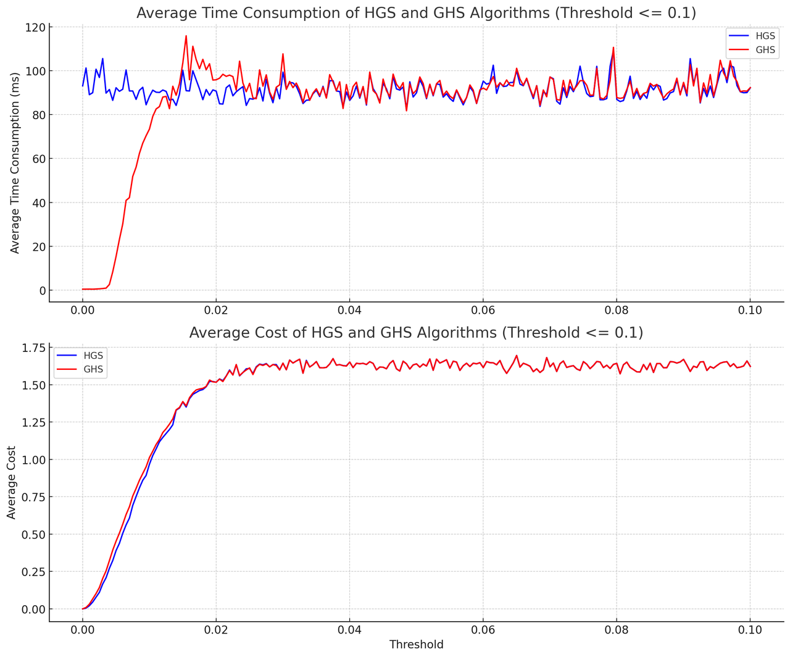
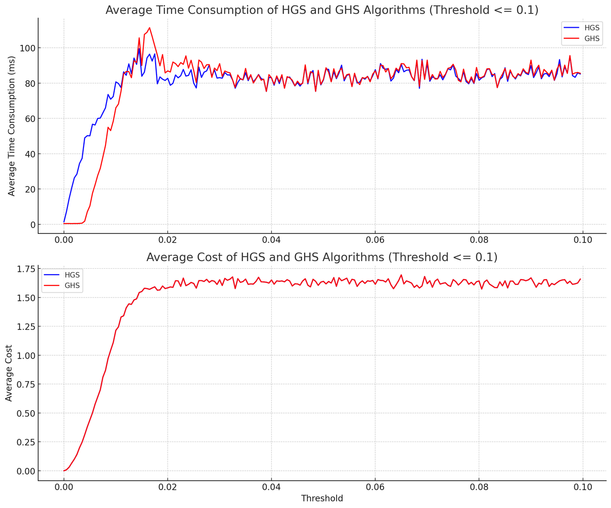
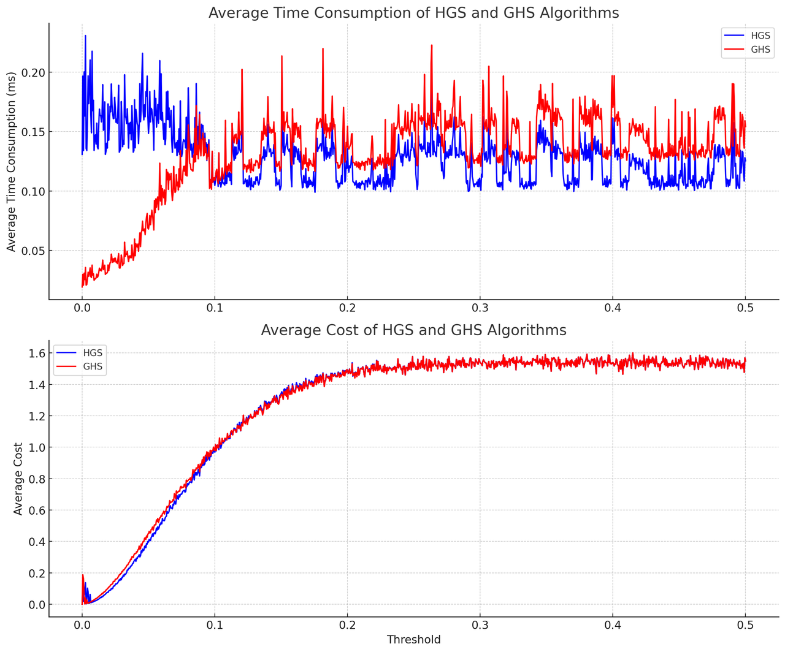
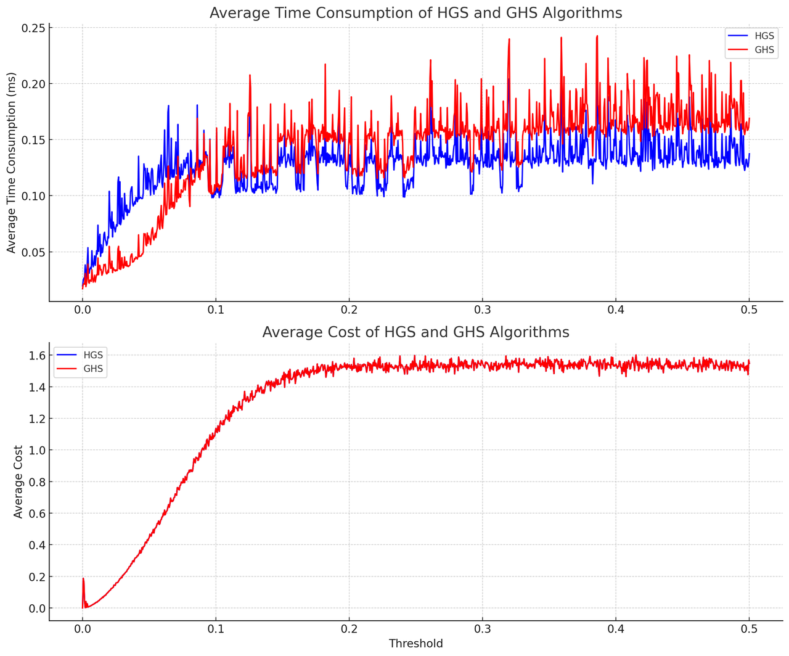

This post discusses the assignment problem, its primal-dual interpretation, and the gated Hungarian algorithm.
# Tutor

[HungarianAlgorithm](https://brilliant.org/wiki/hungarian-matching/) and \[4] gives a nice interpretation of the dual-prime of the Hungarian algorithm.

# Prime-Dual Interpretation of Hungarian Algorithm \[4]

The following linear program gives a lower bound on the optimal value of the assignment problem:

$$\begin{array}{ll}
\min & \sum_{i \in I} \sum_{j \in J} c_{i j} x_{i j} \\
\text { s.t. } & \sum_{j \in J} x_{i j}=1 \text { for all } i \in I \\
& \sum_{i \in I} x_{i j}=1 \text { for all } j \in J \\
& x_{i j} \geq 0
\end{array}$$

To see this, note that we can let $x_{i j}=1$ if $i$ is assigned to $j$ and 0 otherwise. Clearly, this is a feasible solution to the L.P, so the optimal value of the LP must be at most the optimal value of the assignment problem.

We consider the dual of the L.P:

$$\begin{array}{ll}
\max & \sum_{i \in I} u_i+\sum_{j \in J} v_j \\
\text { s.t. } & u_i+v_j \leq c_{i j} \text { for all } i \in I, j \in J
\end{array}$$

Now, we know that $x$ is an optimal solution to the primal L.P and $u, v$ is an optimal solution to the dual LP if and only if (i) $x$ is feasible for the primal LP, (ii) $u, v$ is feasible for the dual LP, (iii) the primal and dual solutions obey complementary slackness.

Thinking about what these conditions mean for the assignment problem allows us to formulate the Hungarian algorithm in a much more general way:

1. We maintain a feasible dual solution. We let $u_i$ be the amount subtracted from row $i$ and $v_j$ is the amount subtracted from column $j$. Feasibility means that we must ensure that $\bar{c}_{i j}=c_{i j}-u_i-v_j$ is non-negative for all $(i, j)$.

2. We try to find a primal solution $x$ that satisfies complementary slackness with respect to the current dual solution. Complementary slackness for the assignment problem means that we try to find an assignment that only uses edges with $\bar{c}_{i j}=0$, i.e., we solve the maximum cardinality bipartite matching problem on the graph that contains a node for every $i \in I, j \in J$ and an edge $(i, j)$ if $\bar{c}_{i j}=0$. We either find a perfect matching, or we get a vertex cover of size $ < n$.

3) If we can not find such a primal solution, we find a direction of dual increase. The vertex cover in the bipartite matching instance corresponds to $I^{\prime}, J^{\prime}$, a subset of the rows and columns, such that $\left|I^{\prime}\right|+\left|J^{\prime}\right| < n$ and if $\bar{c}_{ij}=0$ then $i \in I^{\prime}$ or $j \in J^{\prime}$.

We let $\alpha = \min_{(i,j): i\notin I^\prime, j\notin J^\prime} \bar{c}_{i,j}$, and we update

$$u_i \leftarrow u_i-\alpha \text { for all } i \notin I^{\prime}, \quad v_j \leftarrow v_j+\alpha \text { for all } j \in J^{\prime} .$$

The new dual is feasible, by our choice of $\alpha$. Lemma 2 says that the dual objective strictly increases, and we used this to derive the fact that the algorithm is finite.

> Lemma 2: "The total amount subtracted from the entries in the matrix strictly increases."
>
> Proof. We subtract $\alpha$ from $n\left(n-\left|I^{\prime}\right|\right)$ entries, and we add $\alpha$ to $n\left(\left|J^{\prime}\right|\right)$ entries. Hence in total we subtracted $\alpha n\left(n-\left|I^{\prime}\right|-\left|J^{\prime}\right|\right)$. Now, note that $\left|I^{\prime}\right|+\left|J^{\prime}\right|$ is equal to the size of the vertex cover, which is strictly less than $n$.

> *[**Kőnig's theorem**](https://en.wikipedia.org/wiki/K%C5%91nig%27s_theorem_\(graph_theory\)#:~:text=In%20any%20bipartite%20graph%2C%20the%20number%20of%20edges%20in%20a,in%20a%20minimum%20vertex%20cover.): In any [bipartite graph](https://en.wikipedia.org/wiki/Bipartite_graph), the number of edges in a [maximum matching](https://en.wikipedia.org/wiki/Maximum_matching) equals the number of vertices in a [minimum vertex cover](https://en.wikipedia.org/wiki/Minimum_vertex_cover)*

> [How to uncover vertex cover from maximal match. ](https://math.stackexchange.com/questions/3044261/how-to-find-a-minumum-vertex-cover-from-a-maximum-matching-in-a-bipartite-graph)[Wiki ](https://en.wikipedia.org/wiki/K%C5%91nig%27s_theorem_\(graph_theory\)#:~:text=.%5B4%5D-,Constructive%20proof%20without%20flow%20concepts,-%5Bedit%5D)

This is what is known as a primal-dual algorithm.

# Solving the KKT conditions

$$\begin{array}{ll}
\min & \sum_{i \in I} \sum_{j \in J} c_{i j} x_{i j} \\
\text { s.t. } & \sum_{j \in J} x_{i j}=1 \text { for all } i \in I \\
& \sum_{i \in I} x_{i j}=1 \text { for all } j \in J \\
& x_{i j} \geq 0
\end{array}$$

The Lagrangian

$$\begin{aligned}
L(\mathbf{x}, \mathbf{u}, \mathbf{z}, \mathbf{v}) 
&= \sum_{i,j}c_{i,j}x_{i,j}+\sum_{i}u_i(\sum_j x_{i,j}-1) + \sum_{j} v_j(\sum_jx_{i,j}-1) - \sum_{i,j} z_{i,j} x_{i,j} \\
&= \sum_{i,j}(c_{i,j} + u_i + v_j-z_{i,j})x_{i,j} - \sum_i u_i - \sum_j v_j
\end{aligned}
$$

The KKT conditions are

$$
\begin{cases}
\sum_i x_{i,j} = 1, \\
\sum_j x_{i,j} = 1, \\
x_{i,j} \ge 0, \\
z_{i,j} \ge 0, \\
z_{i,j}x_{i,j}=0, \\
c_{i,j}+u_i + v_j -z_{i,j}=0
\end{cases}$$

$$\Longrightarrow$$

$$\begin{cases}
\sum_i x_{i,j} =1, \\
\sum_j x_{i,j} =1, \\
x_{i,j} \ge 0, \\
c_{i,j} - u_i - v_j \ge 0, \\
\left(c_{i,j} - u_i - v_j \right) x_{i,j} =0
\end{cases}$$

The second to the last equality on the left (or the last equality on the right) is called the slackness condition.

# Gated Hungarian Match

Split the global match problem into sub-problems to reduce computational complexity.

## Algorithm

Given the cost matrix, $\mathbf{C} \in \mathbb{R}^{m \times n}$. Construct the adjacent list, $\mathbf{L}=\{\mathbf{l}_1, \mathbf {l}_2, \dots, \mathbf{l}_{m+n}\}$, where each list, $\mathbf{l}_i$, contains its adjacent nodes. (based on reference \[3])

```c++
  std::vector<std::vector<int>> nb_graph;
  nb_graph.resize(rows_num_ + cols_num_);
  for (size_t i = 0; i < rows_num_; ++i) {
    for (size_t j = 0; j < cols_num_; ++j) {
      if (is_valid_cost_(global_costs_(i, j))) {
        nb_graph[i].push_back(static_cast<int>(rows_num_) + j);
        nb_graph[j + rows_num_].push_back(i);
      }
    }
  }
```

Once the adjacent list is constructed, we need to find its connected components. Here, each component records the connected node numbers. Here we use the breadth-first search.&#x20;

```c++
  int num_item = static_cast<int>(graph.size());
  std::vector<int> visited;
  visited.resize(num_item, 0);
  std::queue<int> que;
  std::vector<int> component;
  component.reserve(num_item);
  components->clear();

  for (int index = 0; index < num_item; ++index) {
    if (visited[index]) {
      continue;
    }
    component.push_back(index);
    que.push(index);
    visited[index] = 1;
    while (!que.empty()) {
      int current_id = que.front();
      que.pop();
      for (size_t sub_index = 0; sub_index < graph[current_id].size();
           ++sub_index) {
        int neighbor_id = graph[current_id][sub_index];
        if (visited[neighbor_id] == 0) {
          component.push_back(neighbor_id);
          que.push(neighbor_id);
          visited[neighbor_id] = 1;
        }
      }
    }
    components->push_back(component);
    component.clear();

```

Use row\_component and col\_component to distinguish node types of the bipartite graph in each component.&#x20;

```c++
  std::vector<std::vector<int>> components;
  ConnectedComponentAnalysis(nb_graph, &components);
  row_components->clear();
  row_components->resize(components.size());
  col_components->clear();
  col_components->resize(components.size());
  for (size_t i = 0; i < components.size(); ++i) {
    for (size_t j = 0; j < components[i].size(); ++j) {
      int id = components[i][j];
      if (id < static_cast<int>(rows_num_)) {
        row_components->at(i).push_back(id);
      } else {
        id -= static_cast<int>(rows_num_);
        col_components->at(i).push_back(id);
      }
    }
  }
```

Find the cost matrix for each connected component and use the rectangular Hungarian method to find the assignment solution.

# Gated Hungarian, Hungarian with a gated cost matrix, and Hungarian

Hungarian method with gated cost matrix: set the values in the cost matrix larger than a threshold to be the maximal allowable values. When some of the values are set to be the largest values, the Hungarian matrix will converge faster. At each step, the Hungarian algorithm will check the distance between primal and dual, and the gated cost matrix results in a faster finding of the global value. (The algorithm will find the smallest of each row and column at each step. When its smallest reaches the threshold, the algorithm will terminate. So, setting the values above the threshold will accelerate computation.)

## Computational time experiments

1. The cost matrix $C \in [0, 1]^{300 \times 300}$, with increasing threshold, at each threshold, repeats experiments 10 times.

    a. do not set values larger than the threshold
    <div style="text-align: center; margin: 0 auto; display: flex; justify-content: center;">
        
    </div>

    b. set values larger than a threshold as the threshold
    <div style="text-align: center; margin: 0 auto; display: flex; justify-content: center;">
        
    </div>

2. $C \in [0, 1]^{30 \times 30}$ , randomly generate cost matrix 100 times and average the values

    a. do not set values larger than the threshold
    <div style="text-align: center; margin: 0 auto; display: flex; justify-content: center;">
        
    </div>

    b. set values larger than the threshold as the threshold
    <div style="text-align: center; margin: 0 auto; display: flex; justify-content: center;">
        
    </div>

## Summary

To use the Hungarian algorithm, the best practice is thresholding the cost matrix before feeding it to the algorithm.  When the cost matrix can be decomposed into more than or equal to two disconnected components, we'd better use the gate Hungarian algorithm.

## Objective values

Hungarian and Hungarian with gated cost matrices will result in different solutions. The gate Hungarian algorithm and the Hungarian algorithm with a gated cost matrix will lead to the same solution. For the objective value, the overall cost of Hungarian with pruning values that are larger than the threshold does not always lead to a smaller value compared with gated Hungarian method. For example, when the cost matrix is

$$C = 
\begin{bmatrix}
0.100973& 0.154588& 0.00125754 \\ 0.904433& 0.728045& 0.596809 \\
0.296041& 0.462023& 0.0037384
\end{bmatrix}
$$

with threshold=0.007. The Hungarian method results in assignments (0,0), (1,1), (2,2), and after pruning values that are larger than the threshold, we have cost=0.003. The gated Hungarian leads to assignments (0, 3) with cost=0.0012. &#x20;

# References

> \[1] J. Bijsterbosch and A. Volgenant, “Solving the Rectangular assignment problem and applications,” Ann Oper Res, vol. 181, no. 1, pp. 443–462, Dec. 2010, doi: 10.1007/s10479-010-0757-3.

> \[2] D. F. Crouse, “On implementing 2D rectangular assignment algorithms,” IEEE Transactions on Aerospace and Electronic Systems, vol. 52, no. 4, pp. 1679–1696, Aug. 2016, doi: 10.1109/TAES.2016.140952.

> \[3] [Gated Hungarian Match (github Apollo C++ code)](https://github.com/ApolloAuto/apollo/blob/master/modules/perception/common/graph/gated_hungarian_bigraph_matcher.h)

> \[4] [lec11.pdf](https://resources.mpi-inf.mpg.de/departments/d1/teaching/ss11/OPT/lec11.pdf)

> \[5] [github C++ code](https://github.com/mcximing/hungarian-algorithm-cpp)

