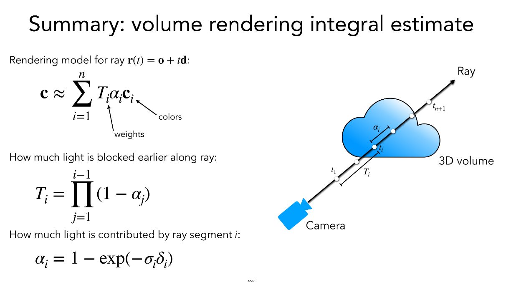
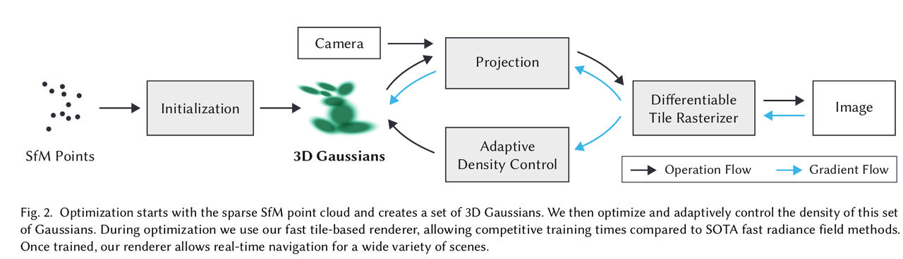
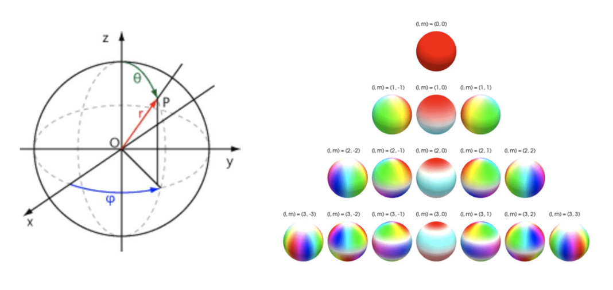
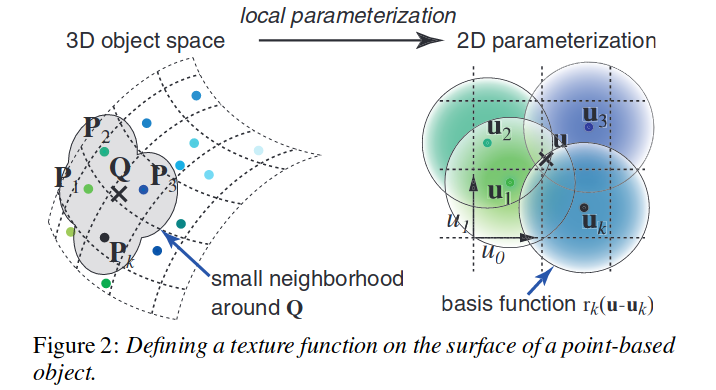
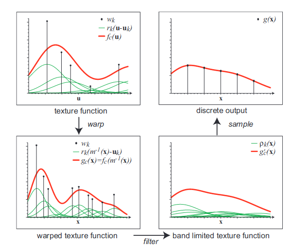
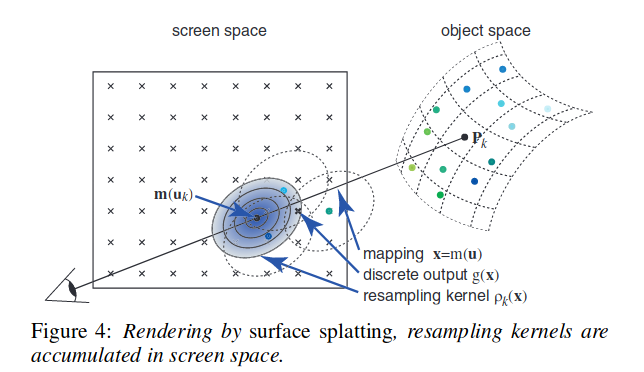

I highly recommend reading the two papers: [5] and [3]. [5] provides a comprehensive description of the splatting process. [3] provides an efficient implementation of the splatting process. 

# Problem formulation

## Volume rendering with radiance fields \[1, 2]

    
    
figure from https://www.cs.cornell.edu/courses/cs5670/2022sp/lectures/lec22_nerf_for_web.pdf

The volume density $\sigma(\mathbf{x})$ can be interpreted as the differential probability of a ray terminating(being absorbed or scattered) at an infinitesimal particle at location $\mathbf{x}$.

The expected color $\mathcal{C}(\mathbf{r})$ of camera ray $\mathbf{r}(t) = \mathbf{o} + t\mathbf{d}$ with near and far bounds $t_n$ and $t_f$ is, where the ray starts from the observer and extends to the far field:

$$\begin{equation}
\mathcal{C}(\mathbf{r}) = \int_{t_n}^{t_f} T(t) \sigma (\mathbf{r}(t)) c(\mathbf{r}(t), \mathbf{d}) \, dt
\end{equation}$$

where $T(t) = \exp \left( -\int_{t_n}^{t} \sigma (\mathbf{r}(s)) \, ds \right)$, and it denotes the accumulated transmittance along the ray from $t_n$ to $t$. (see Appendix A) The color, $c(\mathbf{r}(t), \mathbf{d})$, not only depends on its location but also the viewing direction, $\mathbf{d}$.

From the rendering function, (1), we have two hidden variables, $\sigma(\mathbf{r}(t))$ and $c(\mathbf{r}(t),\mathbf{d})$, that are functions of the location and viewing direction.

### Discretized form

We numerically estimate this continuous integral using quadrature. Deterministic quadrature, which is typically used for rendering discretized voxel grids, would effectively limit our representation's resolution because the MLP would only be queried at a fixed discrete set of locations. Instead, we use a stratified sampling approach where we partition $[t_n, t_f]$ into $N$ evenly-spaced bins and then draw one sample uniformly at random from within each bin:

$$t_i \sim \mathcal{U} \left[ t_n + \frac{i - 1}{N} (t_f - t_n), t_n + \frac{i}{N} (t_f - t_n) \right]$$

Although we use a discrete set of samples to estimate the integral, stratified sampling enables us to represent a continuous scene representation because it results in the MLP being evaluated at continuous positions over the course of optimization. We use these samples to estimate $\hat{C}(\mathbf{r})$ with the quadrature rule discussed in the volume rendering review by Max \[25]:

$$\begin{equation}
\hat{C}(\mathbf{r}) = \sum_{i=1}^N T_i \left(1 - \exp(-\sigma_i \delta_i) \right) c_i, \quad \text{where} \quad T_i = \exp \left( - \sum_{j=1}^{i-1} \sigma_j \delta_j \right)
\end{equation}$$

where $\delta_i = t_{i+1} - t_i$ is the distance between adjacent samples. This function for calculating $\hat{C}(\mathbf{r})$ from the set of $(c_i, \sigma_i)$ values is trivially differentiable and reduces to traditional alpha compositing with alpha values $\alpha_i = 1 - \exp(-\sigma_i \delta_i)$.

### Why $1-\exp(-\sigma_i\delta_i)$?

where From Appendix A, we know $T(t_{i+1}) = \exp(-\int^{t_i}\sigma(t)dt-\int_{t_i}^{t+i}\sigma(t)dt)\approx T(t_i)\exp(-\sigma_i\delta_i)$. Considering the meaning of $T(t_i)$, the term $\exp(-\sigma_i\delta_i)$ can be treated as the probability of not observed. So, $(1-\exp(-\delta_i\sigma_i))$ is interpreted as the probability density of absorbing in the interval of $t_{i}$ and $t_{i+1}$.

Eq. (2) can be re-written as

$C = \sum_{i=1}^{N} T_i \alpha_i c_i,$ $\alpha_i = (1 - \exp(-\sigma_i \delta_i)) \quad \text{and} \quad T_i = \prod_{j=1}^{i-1} (1 - \alpha_j)$

### The point-based method

First, it is assumed that the emission coefficient is approximately constant in the support of each footprint function, hence $\alpha_k(\mathbf{r}) = \alpha_k$, for all $\mathbf{r}$ in the support area." \[5]. A typical neural point-based approach (e.g., \[Kopanas et al. 2022, 2021]) computes the color $C$ of a pixel by blending $\mathcal{N}$ ordered points overlapping the pixel:

$$\begin{equation}
C = \sum_{i \in \mathcal{N}} c_i \alpha_i \prod_{j=1}^{i-1} (1 - \alpha_j)
\end{equation}$$

where $c_i$ is the color of each point and $\alpha_i$ is given by evaluating a 2D Gaussian with covariance $\Sigma$ \[Yifan et al. 2019] multiplied with a learned per-point opacity. In \[3], the color parameterized by spherical harmonics (see Appendix B).

Considering the weight and per-point opacity of Eq. (3), we get

$$\begin{equation}
C = \sum_{i \in \mathcal{N}} c_i \alpha_i w_i \prod_{j=1}^{i-1} (1 - \alpha_jw_j)
\end{equation}$$

where $w_i = \mathcal{G}_i(r_i;\mu_i, \Sigma_i)$ and

$$\mathcal{G}(\mathbf{x} - \mu) = \frac{1}{\sqrt{2 \pi \Sigma(\mathbf{x})}} \exp \left( -\frac{1}{2} (\mathbf{x} - \mu)^T \Sigma^{-1} (\mathbf{x} - \mu) \right)$$

Note: there is mis-alignment between the paper and the implementation of the Gaussian form, in the paper, it discards the normalization term as:

$$G(x) = e^{-\frac{1}{2}(x)^T \Sigma^{-1} (x)}$$

There are some detailed comparisons between the two in [github](https://github.com/graphdeco-inria/gaussian-splatting/issues/294).

## Splatting and sampling

(See Appendix D)

When project 3D Gaussian onto 2D, the covariance matrix is approximately as $\Sigma^\prime = JW\Sigma W^\top J^\top$, where $W$ is the viewing transformation (world to camera rotation) and $J$ is the Jacobian of affine projective transformation (camera to image affine transformation).

Since $\Sigma$ is symmetric and positive definite, it can be represented as

$$\boldsymbol{\Sigma}=\mathbf{R}\mathbf{S}\mathbf{S}^\top\mathbf{R}^\top$$

where $\mathbf{R}$ is a rotation matrix and $\mathbf{S}$ is a positive diagonal matrix, i.e., $\mathbf{S}=\text{diag}(s_1, s_2, s_3)$. The rotation matrix $\mathbf{R}$ can be represented by a Quaternion.

## Optimization

The loss function is $\mathcal{L}_1$ combined with a D-SSIM term:

$$\mathcal{L} = (1 - \lambda) \mathcal{L}_1 + \lambda \mathcal{L}_{\text{D-SSIM}}$$

The parameters include the position $\boldsymbol{\mu}_i$, covariance matrix $\boldsymbol{\Sigma}$, alpha-blending $\alpha$, color, and the spherical harmonics coefficients.

## Method

    
    
figure from [3]

Adaptive Control of Gaussians:

1. Clone 3D gaussians: Under-reconstruction (missing geometric features)

2. Split 3D gaussians: Over-reconstruction (covering large area)

3. Remove 3D gaussians: Opacity is lower than threshold

# 3D Smoothing \[6]

Given the maximal sampling rate $\hat{\nu}_k$ for a primitive, we aim to constrain the maximal frequency of the 3D representation. This is achieved by applying a Gaussian low-pass filter $G_{\text{low}}$ to each 3D Gaussian primitive $G_k$ before projecting it onto screen space

$$\begin{aligned} G_k(\mathbf{x})_{\text{reg}} = (G_k \otimes G_{\text{low}})(\mathbf{x}) \end{aligned}$$

This operation is efficient as convolving two Gaussians with covariance matrices $\Sigma_1$ and $\Sigma_2$ results in another Gaussian with variance $\Sigma_1 + \Sigma_2$. Hence,

$$\begin{aligned} G_k(\mathbf{x})_{\text{reg}} = \sqrt{\frac{|\Sigma_k|}{|\Sigma_k + \frac{s}{\hat{\nu}_k^2} \cdot \mathbf{I}|}} e^{-\frac{1}{2} (\mathbf{x} - \mathbf{p}_k)^T \left( \Sigma_k + \frac{s}{\hat{\nu}_k^2} \cdot \mathbf{I} \right)^{-1} (\mathbf{x} - \mathbf{p}_k)} 
\end{aligned}$$

Here, $s$ is a scalar hyperparameter to control the size of the filter. Note that the scale $\frac{s}{\hat{\nu}_k^2}$ of the 3D filters for each primitive are different as they depend on the training views in which they are visible. By employing 3D Gaussian smoothing, we ensure that the highest frequency component of any Gaussian does not exceed half of its maximal sampling rate for at least one camera. Note that $G_{\text{low}}$ becomes an intrinsic part of the 3D representation, remaining constant post-training.

# 4D Gaussian Splatting \[7]

The 4D Gaussian splatting involves adding another dimension time, $t$, to represent the objects' dynamics. The rendering formula is

$$\mathcal{I}(u,v,t) = \sum_{i=1}^{N} p_i(u,v,t) \alpha_i c_i(d) \prod_{j=1}^{i-1} (1 - p_j(u,v,t) \alpha_j)$$

Note that $p_i(u,v,t)$ can be further factorized as a product of a conditional probability $p_i(u,v|t)$ and a marginal probability $p_i(t)$ at time $t$, yielding:

$$\mathcal{I}(u,v,t) = \sum_{i=1}^{N} p_i(t) p_i(u,v|t) \alpha_i c_i(d) \prod_{j=1}^{i-1} (1 - p_j(t) p_j(u,v|t) \alpha_j)$$

We parameterize its covariance matrix $\Sigma$ as the configuration of a 4D ellipsoid for easing model optimization:

$$\Sigma = R S S^{T} R^{T}$$

where $S$ is a scaling matrix and $R$ is a 4D rotation matrix. Since $S$ is diagonal, it can be completely inscribed by its diagonal elements as $S = \operatorname{diag}(s_x, s_y, s_z, s_t)$. On the other hand, a rotation in 4D Euclidean space can be decomposed into a pair of isotropic rotations, each of which can be represented by a quaternion. [wiki](https://en.wikipedia.org/wiki/Rotations_in_4-dimensional_Euclidean_space)

Specifically, given $q_l = (a, b, c, d)$ and $q_r = (p, q, r, s)$ denoting the left and right isotropic rotations respectively, $R$ can be constructed by:

$$R = L(q_l)R(q_r) = 
\begin{pmatrix}
a & -b & -c & -d \\
b & a & -d & c \\
c & d & a & -b \\
d & -c & b & a 
\end{pmatrix}
\begin{pmatrix}
p & -q & -r & -s \\
q & p & s & -r \\
r & -s & p & q \\
s & r & -q & p
\end{pmatrix}$$

The mean of a 4D Gaussian can be represented by four scalars as $\mu = (\mu_x, \mu_y, \mu_z, \mu_t)$. Thus far we arrive at a complete representation of the general 4D Gaussian.

Subsequently, the conditional 3D Gaussian can be derived from the properties of the multivariate Gaussian with:

$$\mu_{xyz|t} = \mu_{1:3} + \Sigma_{1:3,4}\Sigma_{4,4}^{-1}(t - \mu_t),$$

$$\Sigma_{xyz|t} = \Sigma_{1:3,1:3} - \Sigma_{1:3,4}\Sigma_{4,4}^{-1}\Sigma_{4,1:3}$$

Moreover, the marginal $p_i(t)$ is also a Gaussian in one-dimension:

$$p(t) = \mathcal{N}(t; \mu_4, \Sigma_{4,4})$$

## 4D spherindrical harmonics

Inspired by studies on head-related transfer function, we propose to represent $c_i(d, t)$ as the combination of a series of 4D spherindrical harmonics (4DSH) which are constructed by merging SH with different 1D-basis functions. For computational convenience, we use the Fourier series as the adopted 1D-basis functions. Consequently, 4DSH can be expressed as:

$$Z_{nl}^{m}(t, \theta, \phi) = \cos\left(\frac{2\pi n}{T} t\right) Y_{l}^{m}(\theta, \phi)$$

where $Y_{l}^{m}$ is the 3D spherical harmonics. The index $l \geq 0$ denotes its degree, and $m$ is the order satisfying $-l \leq m \leq l$. The index $n$ is the order of the Fourier series. The 4D spherindrical harmonics form an orthonormal basis in the spherindrical coordinate system.

# Appendix

## Appendix A: Understand the Accumulated transmittance

**Volume Density** $\sigma(\mathbf{x})$:

* The volume density $\sigma(\mathbf{x})$ at a point $\mathbf{x}$ represents the differential probability per unit length that a ray will be absorbed or scattered at that point.

- **Survival Probability** $T(t)$:

* $T(t)$ represents the probability that a ray traveling along a path $\mathbf{r}(t)$ from $t_n$ to $t_n$ has not been absorbed or scattered.

* It can be thought of as the transmittance or the cumulative probability of the ray surviving up to point $t_n$.

### Differential Equation for Transmittance

To derive the transmittance function, we consider how the survival probability changes over an infinitesimal segment of the ray path.

#### Step-by-Step Derivation:

1. **Infinitesimal Segment**:

   * Consider a small segment of the ray's path from $t$ to $t + dt$.

   * The probability that the ray is not absorbed or scattered in this small segment is $1 - \sigma(\mathbf{r}(t)) dt$.

2. **Survival Probability Over the Small Segment**:
   * If the ray has survived up to $t$ with probability $T(t)$, the probability that it also survives the next small segment $dt$ is:

    $$T(t + dt) = T(t) \cdot (1 - \sigma(\mathbf{r}(t)) dt)$$

* **Taking the Limit**:

  * As $dt$ approaches zero, this becomes:

    $$\frac{T(t + dt) - T(t)}{dt} \approx -\sigma(\mathbf{r}(t)) T(t)$$

    $$\frac{dT(t)}{dt} = -\sigma(\mathbf{r}(t)) T(t)$$

### Solving the Differential Equation

1. **Separation of Variables**:

   * Rewrite the differential equation to separate the variables $T$ and $t$:

    $$\frac{dT(t)}{T(t)} = -\sigma(\mathbf{r}(t)) dt$$

2. **Integrating Both Sides**:

   * Integrate both sides with respect to their respective variables:

    $$ \int \frac{dT(t)}{T(t)} = - \int \sigma(\mathbf{r}(t)) dt$$

    $$ \ln|T(t)| = - \int_{t_n}^t \sigma(\mathbf{r}(s)) ds + C$$

    where $C$ is the integration constant.

3. **Exponentiating Both Sides**:

   * Solve for $T(t)$ by exponentiating both sides:

    $$T(t) = e^{-\int_{t_n}^t \sigma(\mathbf{r}(s)) ds + C}$$

    $$ T(t) = e^{-\int_{t_n}^t \sigma(\mathbf{r}(s)) ds}$$

In neural radiance fields (NeRF) and other volumetric rendering techniques, spherical harmonics are used to efficiently represent the directional dependency of emitted radiance (color) at each point in the volume. Given that color is a three-dimensional vector (representing the RGB color channels), spherical harmonics can be employed to represent each of these color channels separately for each direction.

## Appendix B: Spherical Harmonics in Neural Radiance Fields

    
    
figure from https://sgvr.kaist.ac.kr/\~sungeui/ICG/Students/\[CS482\]%203D%20Gaussian%20Splatting%20for%20Real-Time%20Radiance%20Field%20Rendering.

1. **Radiance Representation**:

   * In a neural radiance field, the color $c(\mathbf{x}, \mathbf{d})$ emitted from a point $\mathbf{x}$ in the direction $\mathbf{d}$ can vary depending on the direction $\mathbf{d}$.

   * Instead of storing the color for every possible direction, which is computationally infeasible, spherical harmonics allow for a compact representation.

2. **Spherical Harmonics Expansion**:

   * The color at each point can be expanded into spherical harmonics:

    $$c(\mathbf{x}, \mathbf{d}) = \sum_{\ell=0}^{L} \sum_{m=-\ell}^{\ell} c_{\ell m}(\mathbf{x}) Y_{\ell m}(\mathbf{d})$$

3. **RGB Color Channels**:

   * Since color is a three-dimensional vector (RGB), each color channel can be represented using its own set of spherical harmonics coefficients:

    $$c_r(\mathbf{x}, \mathbf{d}) = \sum_{\ell=0}^{L} \sum_{m=-\ell}^{\ell} c_{\ell m}^r(\mathbf{x}) Y_{\ell m}(\mathbf{d})$$

    $$ c_g(\mathbf{x}, \mathbf{d}) = \sum_{\ell=0}^{L} \sum_{m=-\ell}^{\ell} c_{\ell m}^g(\mathbf{x}) Y_{\ell m}(\mathbf{d})$$

    $$ c_b(\mathbf{x}, \mathbf{d}) = \sum_{\ell=0}^{L} \sum_{m=-\ell}^{\ell} c_{\ell m}^b(\mathbf{x}) Y_{\ell m}(\mathbf{d})$$

* Here, $c_{\ell m}^r(\mathbf{x})$, $c_{\ell m}^g(\mathbf{x})$, and $c_{\ell m}^b(\mathbf{x})$ are the spherical harmonics coefficients for the red, green, and blue color channels, respectively.

* Write it in a more compact form

$$\mathbf{c}(\mathbf{x}, \mathbf{d}) = \sum_{\ell=0}^{L} \sum_{m=-\ell}^{\ell} \mathbf{c}_{\ell m}(\mathbf{x}) Y_{\ell m}(\mathbf{d})$$

where $\mathbf{c}_{lm}=[c^r, c^g, c^b]^\top$.

4. **Advantages**:

   * **Compactness**: Using a small number of spherical harmonics coefficients can effectively capture the variation in color with direction, reducing the memory and computational requirements.

   * **Efficiency**: Once the coefficients are computed, evaluating the color for any direction $\mathbf{d}$ is efficient, involving only a sum of products.

   * **Smoothness**: Spherical harmonics provide a smooth interpolation of the radiance function, which is particularly useful for rendering soft lighting and shadows.

5. **Neural Network Training**:

   * During the training of a neural radiance field, the network learns to predict the spherical harmonics coefficients $c_{\ell m}(\mathbf{x})$ for each point $\mathbf{x}$.

   * The input to the network typically includes the spatial location $\mathbf{x}$ and sometimes additional features like view direction $\mathbf{d}$ to capture more complex lighting effects.

## Appendix C: from surface to point splatting

### Surface splatting \[4]

#### Texture functions on point-based objects

    
    
figure from [4]

The points $\mathbf{Q}$ and $\mathbf{P_k}$ have local coordinates $\mathbf{u}$ and $\mathbf{u_k}$, respectively. We define the continuous surface function $f_c(\mathbf{u})$ as the weighted sum:

$$f_c(\mathbf{u}) = \sum_{k \in \mathbb{N}} w_k r_k (\mathbf{u} - \mathbf{u_k})$$

where the basis functions $r_k$ that have local support or that are appropriately truncated.

#### Rendering

    
    
figure from [4]

1. Warp $f_c(\mathbf{u})$ to screen space, yielding the warped, continuous screen space signal $g_c(\mathbf{x})$:

$$g_c(\mathbf{x}) = (f_c \circ \mathbf{m}^{-1})(\mathbf{x}) = f_c(\mathbf{m}^{-1}(\mathbf{x}))$$

where $\circ$ denotes function concatenation.

* Band-limit the screen space signal using a prefilter $h$, resulting in the continuous output function $g'_c(\mathbf{x})$:

$$ g'_c(\mathbf{x}) = g_c(\mathbf{x}) \otimes h(\mathbf{x}) = \int_{\mathbb{R}^2} g_c(\boldsymbol{\xi}) h(\mathbf{x} - \boldsymbol{\xi}) d\boldsymbol{\xi}$$

where $\otimes$ denotes convolution.

* Sample the continuous output function by multiplying it with an $\textit{impulse train}$ $i$ to produce the discrete output $g(\mathbf{x})$:

$$ g(\mathbf{x}) = g'_c(\mathbf{x}) i(\mathbf{x})$$

An explicit expression for the warped continuous output function can be derived by expanding the above relations in reverse order:

$$\begin{equation}
g'_c(\mathbf{x}) = \int_{\mathbb{R}^2} h(\mathbf{x} - \boldsymbol{\xi}) \sum_{k \in \mathbb{N}} w_k r_k(\mathbf{m}^{-1}(\boldsymbol{\xi}) - \mathbf{u_k}) d\boldsymbol{\xi} = \sum_{k \in \mathbb{N}} w_k \rho_k(\mathbf{x})
\end{equation}$$

where

$$\rho_k(\mathbf{x}) = \int_{\mathbb{R}^2} h(\mathbf{x} - \boldsymbol{\xi}) r_k(\mathbf{m}^{-1}(\boldsymbol{\xi}) - \mathbf{u_k}) d\boldsymbol{\xi}$$

We call a warped and filtered basis function $\rho_k(\mathbf{x})$ a $\textit{resampling kernel}$$, which is expressed here as a screen space integral. Equation (5) states that we can first warp and filter each basis function $r_k$ individually to construct these resampling kernels $\rho_k$, and then sum up the contributions of these kernels in screen space. We call this approach $\textit{surface splatting}$.

    
    
figure from [4]

In order to simplify the integral for $\rho_k(\mathbf{x})$ in (5), we replace a general mapping $\mathbf{m}(\mathbf{u})$ by its local affine approximation $\mathbf{m_{u_k}}$ at a point $\mathbf{u_k}$,

$$\mathbf{m_{u_k}}(\mathbf{u}) = \mathbf{x_k} + \mathbf{J_{u_k}} \cdot (\mathbf{u} - \mathbf{u_k})$$

where $\mathbf{x_k} = \mathbf{m}(\mathbf{u_k})$ and the Jacobian $\mathbf{J_{u_k}} = \frac{\partial \mathbf{m}}{\partial \mathbf{u}} (\mathbf{u_k})$.

Since the basis functions $r_k$ have local support, $\mathbf{m_{u_k}}$ is used only in a small neighborhood around $\mathbf{u_k}$ in (5). Moreover, the approximation is most accurate in the neighborhood of $\mathbf{u_k}$ and so it does not cause visual artifacts. We use it to rearrange Equation (5), and after a few steps we find:

$$\rho_k(\mathbf{x}) = \int_{\mathbb{R}^2} h(\mathbf{x} - \mathbf{m_{u_k}}(\mathbf{u_k}) - \boldsymbol{\xi}) r'_k(\boldsymbol{\xi}) d\boldsymbol{\xi} = (r'_k \otimes h)(\mathbf{x} - \mathbf{m_{u_k}}(\mathbf{u_k}))$$

where $r'_k(\mathbf{x}) = r_k(\mathbf{J_{u_k}^{-1}} \mathbf{x})$ denotes a warped basis function. Thus, although the texture function is defined on an irregular grid, Equation (5) states that the resampling kernel in screen space, $\rho_k(\mathbf{x})$, can be written as a $\textit{convolution}$ of a warped basis function $r'_k$ and the low-pass filter kernel $h$. This is essential for the derivation of screen space EWA in the next section. Note that from now on we are omitting the subscript $u_k$ for $\mathbf{m}$ and $\mathbf{J}$.

#### Screen Space EWA

We choose elliptical Gaussians both for the basis functions and the low-pass filter, since they are closed under affine mappings and convolution. An elliptical Gaussian $\mathcal{G}_{\mathbf{V}}(\mathbf{x})$ with variance matrix $\mathbf{V}$ is defined as, for $\mathbf{x}\in\mathbb{R}^2$,

$$\mathcal{G}_{\mathbf{V}}(\mathbf{x}) = \frac{1}{2\pi \sqrt{|\mathbf{V}|}} e^{-\frac{1}{2} \mathbf{x}^T \mathbf{V}^{-1} \mathbf{x}}$$

where $|\mathbf{V}|$ is the determinant of $\mathbf{V}$. We denote the variance matrices of the basis functions $r_k$ and the low-pass filter $h$ with $\mathbf{V}^r_k$ and $\mathbf{V}^h$, respectively. The warped basis function and the low-pass filter are:

$$r'_k(\mathbf{x}) = r(\mathbf{J}^{-1}\mathbf{x}) = \mathcal{G}_{\mathbf{V}^r_k}(\mathbf{J}^{-1}\mathbf{x}) = \frac{1}{|\mathbf{J}|^{-1}} \mathcal{G}_{\mathbf{J}\mathbf{V}^r_k \mathbf{J}^T}(\mathbf{x})\\
h(\mathbf{x}) = \mathcal{G}_{\mathbf{V}^h}(\mathbf{x}).$$

The resampling kernel $\rho_k$ of (5) can be written as a single Gaussian with a variance matrix that combines the warped basis function and the low-pass filter. Typically $\mathbf{V}^h = \mathbf{I}$, yielding:

$$
\begin{aligned}
\rho_k(\mathbf{x}) &= (r'_k \otimes h)(\mathbf{x} - \mathbf{m}(\mathbf{u_k})) \\
&= \frac{1}{|\mathbf{J}|^{-1}} (\mathcal{G}_{\mathbf{J}\mathbf{V}^r_k \mathbf{J}^T} \otimes \mathcal{G}_{\mathbf{I}})(\mathbf{x} - \mathbf{m}(\mathbf{u_k})) \\
&= \frac{1}{|\mathbf{J}|^{-1}} \mathcal{G}_{\mathbf{J}\mathbf{V}^r_k \mathbf{J}^T + \mathbf{I}}(\mathbf{x} - \mathbf{m}(\mathbf{u_k}))
\end{aligned}
$$

We will show how to determine $\mathbf{J}^{-1}$ in Section 4, and how to compute $\mathbf{V}^r_k$ in Section 5. Substituting the Gaussian resampling kernel (6) into (5) we get the continuous output function is the weighted sum:

$$g'_c(\mathbf{x}) = \sum_{k \in \mathbb{N}} w_k \frac{1}{|\mathbf{J}|^{-1}} \mathcal{G}_{\mathbf{J}\mathbf{V}^r_k \mathbf{J}^T + \mathbf{I}} (\mathbf{x} - \mathbf{m}(\mathbf{u_k}))$$

We call this novel formulation $\textit{screen space EWA}$.

#### Object with per point color

Many of today's imaging systems, such as laser range scanners or passive vision systems, acquire range and color information. In such cases, the acquisition process provides a color sample $c_k$ with each point. We have to compute a continuous approximation $f_c(\mathbf{u})$ of the unknown original texture function from the irregular set of samples $c_k$.

A computationally reasonable approximation is to normalize the basis functions $r_k$ to form a partition of unity, i.e., to sum up to one everywhere. Then we use the samples as coefficients, hence $w_k = c_k$, and build a weighted sum of the samples $c_k$:

$$f_c(\mathbf{u}) = \sum_{k \in \mathbb{N}} c_k \hat{r}_k (\mathbf{u} - \mathbf{u}_k) = \sum_{k \in \mathbb{N}} c_k \frac{r_k (\mathbf{u} - \mathbf{u}_k)}{\sum_{j \in \mathbb{N}} r_j (\mathbf{u} - \mathbf{u}_j)}$$

## Appendix D: perspective transformation

These statements may be unclear to readers. From reference [5], we know the author is talking about the transformation from ray space to image space. Converting the camera space, $[t_0, t_1, t_2]^\top$, to the ray space, $[x_0, x_1, x_2]^\top$ follows

$$\begin{aligned}
\begin{bmatrix}
x_0 \\
x_1 \\
x_2
\end{bmatrix} =
\phi(\mathbf{t}) =
\begin{bmatrix}
t_0 / t_2 \\
t_1 / t_2 \\
\| (t_0, t_1, t_2) \|^T
\end{bmatrix}
\end{aligned}$$

Then, from ray space to camera space is simply integrating out $x_2$.

Actually, we can go directly from camera space to image space by using the perspective transformation

$$t_2 
\begin{bmatrix}
x_0\\
x_1 \\
1
\end{bmatrix} =
\begin{bmatrix}
f_x&0&c_x\\
0&f_y&c_y\\
0&0&1
\end{bmatrix}
\begin{bmatrix}
t_0\\
t_1\\
t_2
\end{bmatrix}$$

Then, we do linear approximation.

# References

> \[1] J. T. Kajiya and B. P. V. Herren, “RAY TRACING VOLUME DENSITIES”.

> \[2] B. Mildenhall, P. P. Srinivasan, M. Tancik, J. T. Barron, R. Ramamoorthi, and R. Ng, “NeRF: Representing Scenes as Neural Radiance Fields for View Synthesis”.

> \[3] B. Kerbl, G. Kopanas, T. Leimkühler, and G. Drettakis, “3D Gaussian Splatting for Real-Time Radiance Field Rendering.” arXiv, Aug. 08, 2023. doi: 10.48550/arXiv.2308.04079.

> \[4] M. Zwicker, H. Pfister, J. Van Baar, and M. Gross, “Surface splatting,” in Proceedings of the 28th annual conference on Computer graphics and interactive techniques, ACM, Aug. 2001, pp. 371–378. doi: 10.1145/383259.383300.

> \[5] M. Zwicker, H. Pfister, J. van Baar and M. Gross, "EWA splatting," in IEEE Transactions on Visualization and Computer Graphics, vol. 8, no. 3, pp. 223-238, July-Sept. 2002, doi: 10.1109/TVCG.2002.1021576.

> \[6] Z. Yu, A. Chen, B. Huang, T. Sattler, and A. Geiger, “Mip-Splatting: Alias-free 3D Gaussian Splatting”.

> \[7] Z. Yang, H. Yang, Z. Pan, and L. Zhang, “Real-time Photorealistic Dynamic Scene Representation and Rendering with 4D Gaussian Splatting,” Feb. 22, 2024, arXiv: arXiv:2310.10642. Accessed: Jul. 11, 2024. \[Online]. Available: http://arxiv.org/abs/2310.10642
