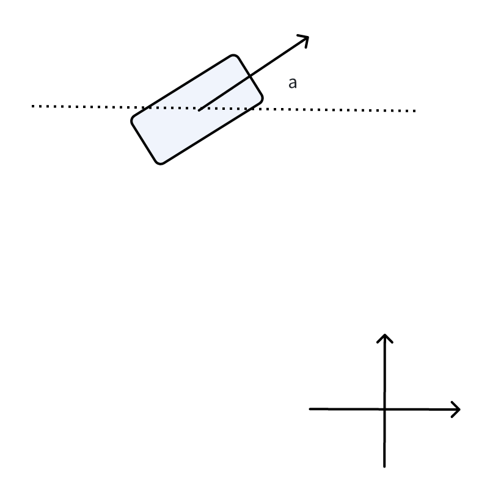

Besides object position tracking, heading angle tracking is also critical in autonomous driving. In this article, we will discuss how to track the angle of an object using the Kalman filter and how to do motion compensation.

# Wrap the angle

In this paper "On wrapping the Kalman filter and estimating with the SO(2) group", the author has the conclusion:

"based on the mathematically grounded framework of filtering on Lie groups, yields the same result as heuristically wrapping the angular variable within the EKF framework".

So, when using the Kalman filter for angles, we should wrap the angle into $(0, 360]$ or $(-180, 180]$. When calculating the difference of angle, make sure it is between $(-180, 180]$.

# Ego-motion compensation

<figure style="text-align: center;">
    
    <figcaption style="font-weight: normal;">The object's headning angle in the ego's coordinate.</figcaption>
</figure>

Assume the observed angle is $\theta$, the ego car's yaw angle is $\alpha$, the object's heading angle angle in the world coordinate is $\beta$. We have

$$\theta = \beta - \alpha$$

Suppose the observation and dynamic model of the object is

$$\begin{aligned}
\mathbf{y}_k &= \mathcal{H} \circ \mathbf{x}_k + \mathbf{w}_k \\
\mathbf{x}_k &= \mathcal{F}\circ \mathbf{x}_{k-1} + \mathbf{v}_{k}
\end{aligned},$$

where $\mathbf{x}$ is the augmented state of the object.

Let $\boldsymbol{\theta}$, $\boldsymbol{\beta}$, and $\boldsymbol{\alpha}$ be the state vector of the measure, objects, and ego's yaw, respectively.

$$\begin{aligned}
\mathbf{y}_k &= \mathcal{H}_k \circ \boldsymbol{\theta}_k + \mathbf{w}_k \\
\boldsymbol{\beta}_k & = \mathcal{F}_k\circ\boldsymbol{\beta}_{k-1} + \mathbf{v}_{k}
\end{aligned}.$$

Substitute the express of $\boldsymbol{\beta}$, we have

$$\begin{aligned}
\mathbf{y}_k &= \mathcal{H}_k \circ \boldsymbol{\theta}_k + \mathbf{w}_k \\
\boldsymbol{\theta}_k + \boldsymbol{\alpha}_k &= \mathcal{F}_k\circ (\boldsymbol{\theta}_{k-1}+\boldsymbol{\alpha}_{k-1}) + \mathbf{v}_{k}
\end{aligned}.$$

Expand the dynamic expression

$$\boldsymbol{\theta}_k = \mathcal{F}_k \circ \boldsymbol{\theta}_{k-1} + \mathcal{F}_k\circ \boldsymbol{\alpha}_{k-1} - \boldsymbol{\alpha}_k + \mathbf{v}_k.$$

Assume the dynamic of the ego-car's yaw follows the same pattern as of the object's yaw, and let $\mathbf{n}_k  = \mathcal{F}_k \boldsymbol{\alpha}_{k-1} - \boldsymbol{\alpha}_k$, we have the dynamic model

$$\boldsymbol{\theta}_k = \mathcal{F}_k\circ\boldsymbol{\theta}_{k-1} + \mathbf{v}_k + \mathbf{n}_k$$

So, the dynamic model is almost the same as without ego motion compensation, except that we have another noisy term, $\mathbf{n}_k$, which is the result of the deviation of the ego-car's motion.

# Reference

> \[1] Marković I, Ćesić J, Petrović I. On wrapping the Kalman filter and estimating with the SO (2) group. 2016 19th International Conference on Information Fusion (FUSION) 2016 Jul 5 (pp. 2245-2250). IEEE.

