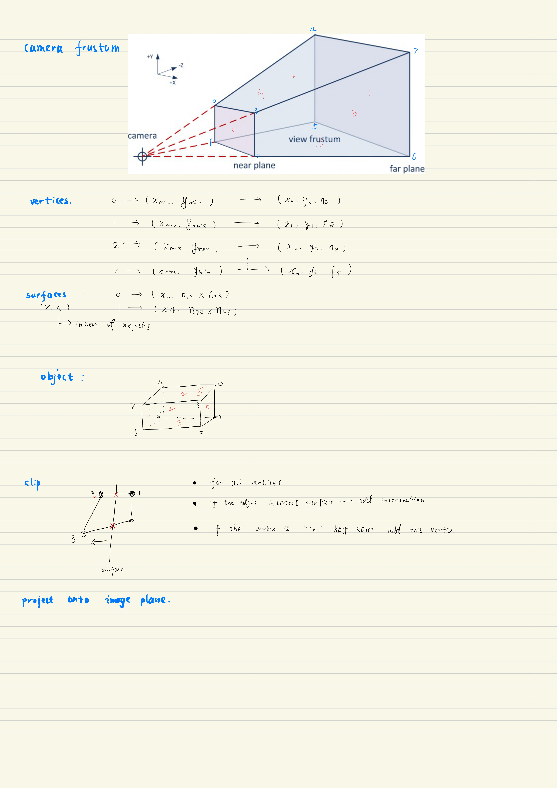
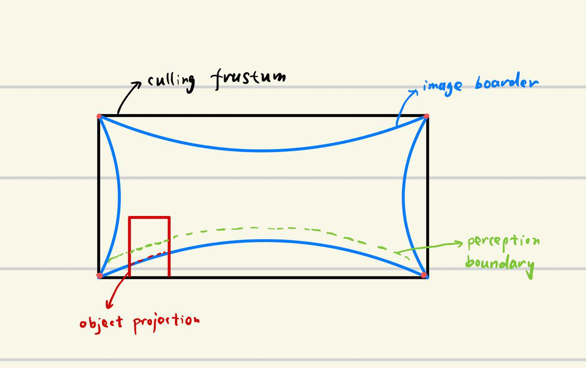
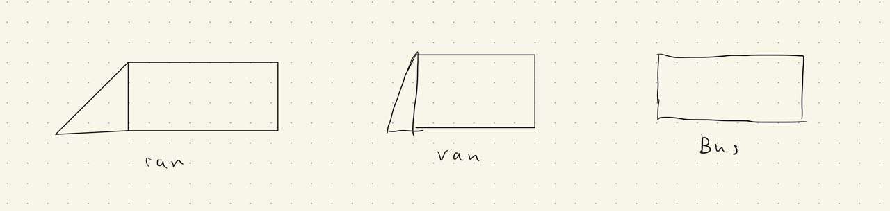
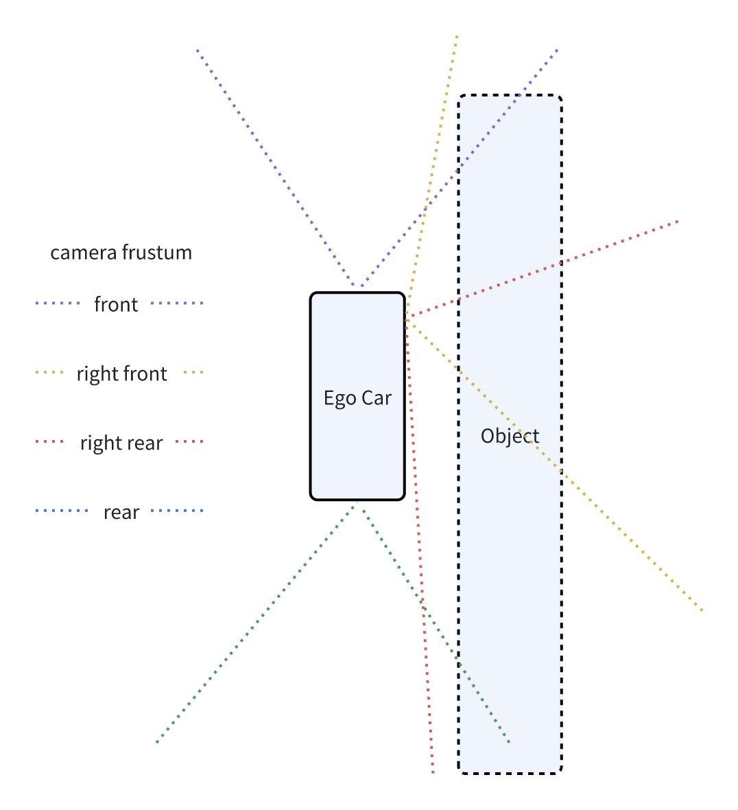
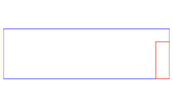
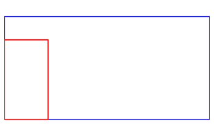
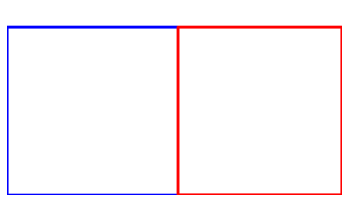
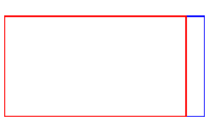

When projecting a 3D object onto the camera plane, we usually use the pinhole model. However, it only applies to a single point. When we consider a solid object, we need to consider the interaction between the object and the camera, especially when the object is close to the camera. In the following, we will use the view frustum to cull the object and project it onto the camera plane.

# Object projection

## Use view frustum to cull the object box

    

## Algorithm

1. Compute the frustum of the camera given camera parameters (intrinsic, region of perception, near and far field depth): the frustum is constructed from the intersection of six surfaces. Each surface is depicted by a point and a normal vector. Each normal vector points to the interested area of the camera.&#x20;

2. Construct the object: an object is ideally modeled as a cuboid which comprises six convex polygons. The order of the vertices follows the right-hand rule and points to the inner of the object.

3. Use the frustum to cut the object

   1. Surface culls a convex polygon

   2. Six surfaces cull a convex polygon

   3. Six surfaces cull six convex polygons

### A surface clips a polygon

Please refer to [1] for more details.

## Distorted image

    

Green line indicates the boundary of the perception area, blue line the boundary of camera, and black line the frustum boundary

$$$$
Since we use four corner vertices to compute the frustum, it is different from the actual frustum, which is curved. Objects culled by this boundary are usually outside the perception area. We should clip them into the perception area further.

## Advantages

Can handle the case that an object is close to a camera. (the detection box is on the boundary of the camera)

## Usage and Limitations

1. The frustum is represented as the intersection of six surfaces, which is a pyramid in 3D space, and assuming the image is undistorted.&#x20;

2. The frustum should be convex.

3. Since using the surface to clip a convex polygon, we must assume each surface of the object is a convex polygon. (that is why objects are represented by small triangles?) Note that the object does not need to be convex.

## Extensions and improvements

We can further refine the shape of vehicles. For example:

    

## Examples

In this example, we demonstrate results of the 3D object projected onto the camera by camera frustum culling.

<figure style="text-align: center;">
    

        
    

    <figcaption style="font-weight: normal;">
        A top-down view of the camera positions, their frustums, ego car, and the object.
    </figcaption>
</figure>

<figure style="text-align: center;">
    

        
        
        
        
    

    <figcaption style="font-weight: normal;">
        2D bounding box of the object on different cameras. The blue line is the camera frustum boundary, and the red line is the projected 2D bounding box. First row is the front view and rear view, the second row is the right-front view and right-rear view.
    </figcaption>
</figure>

# Compute the position of a pixel that is on a world surface

Given a reference point in pixel coordinate $(u,v)$; camera intrinsic: $\mathbf F$; rotation matrix from lidar to camera: $\mathbf R$; translation vector from lidar to camera: $\mathbf t$.

we have

$$
d
\begin{bmatrix}
u \\
v \\
1
\end{bmatrix} = \mathbf{F}
\begin{bmatrix}
x'\\
y'\\
z'
\end{bmatrix},$$

where $d$ is the depth from the camera's view, $[x',y',z']$ is the coordinate in the camera. Further,

$$
\begin{bmatrix}
x'\\
y'\\
z'\\
\end{bmatrix} =\mathbf{R}
\begin{bmatrix}
x\\ y\\ z
\end{bmatrix}
+\mathbf{t},
$$

So, we have

$$(\mathbf{FR})^{-1}
d
\begin{bmatrix}
u \\ v \\ 1
\end{bmatrix} =
\begin{bmatrix}
x \\ y\\ z
\end{bmatrix}
+\mathbf{R}^{-1}\mathbf{t}$$

Let

$$\begin{bmatrix}
\hat{x}\\ \hat{y} \\ \hat{z}
\end{bmatrix} =
(\mathbf{FR})^{-1}
\begin{bmatrix}
u \\ v \\ 1 
\end{bmatrix}$$

and $\hat{\mathbf t} = \mathbf{R}^{-1}\mathbf{t}$, we have

$$
d 
\begin{bmatrix}
\hat x \\
\hat y \\
\hat z
\end{bmatrix} = 
\begin{bmatrix}
x\\
y\\
z
\end{bmatrix}
+\hat{\mathbf{t}},
\tag{1}$$

Combine with the surface

$$a_x x + a_y y + a_z z + c =0, \tag{2}$$

we have

$$x = d\hat x - t_x,\quad
y = d\hat y - t_y, \quad
z = d\hat z - t_z$$

where $\hat t = [t_x, t_y, t_z]^\top$.

Let $\hat{\mathbf x} = [\hat x, \hat y, \hat z]^\top$ and $\mathbf x = [x, y, z]^\top$, and combine (1) (2) we have

$$\begin{cases}
d\hat{\mathbf x} = \mathbf x + \hat{\mathbf t} \\
\mathbf a^\top \mathbf x +c =0
\end{cases},$$

where $\mathbf a=[a_x, a_y, a_z]^\top$

So, $\mathbf{a}^\top(d\hat{\mathbf x}-\hat{\mathbf t})+c =0$, and $d \mathbf{a}^\top\hat{\mathbf x} = \mathbf a^\top\hat{\mathbf t} -c$.

1. if $\mathbf a^\top \hat{\mathbf t} - c=0$ and $\mathbf a^\top \hat{\mathbf x} \neq 0$, we have $d=0$, and $\mathbf x = -\mathbf{\hat t}$.

2. if $\mathbf a^\top \hat{\mathbf t} - c=0$ and $\mathbf a^\top \hat{\mathbf x} = 0$, then $d$ can be arbitrary.

3) if $\mathbf a^\top \hat{\mathbf t} - c\neq 0$ and $\mathbf a^\top \hat{\mathbf x} =0$, no solution

4) if $\mathbf a^\top \hat{\mathbf t} - c\neq 0$ and $\mathbf a^\top \hat{\mathbf x} \neq 0$ we have

$$d = \frac{\mathbf a^\top \hat{\mathbf t} - c}{\mathbf a^\top \hat{\mathbf x}}$$

and

$$\mathbf x = d\hat{\mathbf x} - \hat{\mathbf t}$$

# References
> [1] Joy, Kenneth I. "Clipping." On-Line Computer Graphics Notes, Visualization and Graphics Research Group, Department of Computer Science, University of California, Davis.