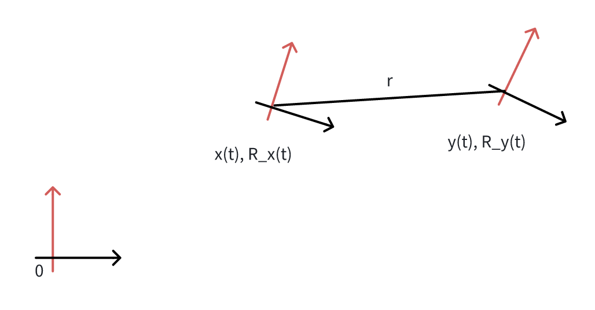
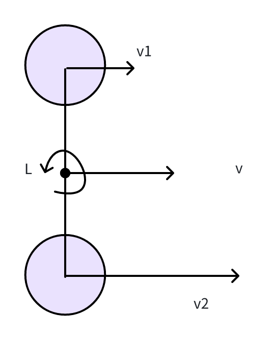

This document mainly follows \[1] and \[2].

# Preliminaries

Let $\mathcal{M}$ be the manifold of dimension $n$ in consideration (e.g., $\mathcal{M} = SO(3)$). Since manifolds are locally homeomorphic to $\mathbb{R}^n$, we can establish a bijective mapping from a local neighborhood on $\mathcal{M}$ to its tangent space $\mathbb{R}^n$ via two encapsulation operators $\boxplus$ and $\boxminus$:

$$\boxplus : \mathcal{M} \times \mathbb{R}^n \to \mathcal{M};
\boxminus : \mathcal{M} \times \mathcal{M} \to \mathbb{R}^n$$
$$
\text{for } \mathcal{M} = SO(3) : \mathbf{R} \boxplus \mathbf{r} = \mathbf{R} \text{Exp}(\mathbf{r});\quad \mathbf{R}_1 \boxminus \mathbf{R}_2 = \text{Log}(\mathbf{R}_2^T \mathbf{R}_1) $$
$$\text{for }\mathcal{M} = \mathbb{R}^n : \mathbf{a} \boxplus \mathbf{b} = \mathbf{a} + \mathbf{b}; \quad \mathbf{a} \boxminus \mathbf{b} = \mathbf{a} - \mathbf{b}
$$

where $\text{Exp}(\cdot)$ is the exponential map and $\text{Log}(\cdot)$ is its inverse map.

$$\text{Exp}(\theta \mathbf{u})=\mathbf{R}(\boldsymbol{\theta})
\triangleq \mathbf{I} + \sin\theta[\mathbf{u} ]_\times + (1-\cos\theta)[\mathbf{u}]_\times^2
$$,

$$[\boldsymbol{\theta}]_\times=
\begin{bmatrix}
0&-\theta_z&\theta_y\\
\theta_z&0&-\theta_x\\
-\theta_y&\theta_x&0
\end{bmatrix}
$$,

where $\boldsymbol{\theta}= \theta\mathbf{u}$ and $\|\mathbf{u}\|=1$.

For a compound manifold $$\mathcal{M} = SO(3) \times \mathbb{R}^n$$ we have:

$$\begin{bmatrix}
\mathbf{R} \\ \mathbf{a}
\end{bmatrix}
\boxplus
\begin{bmatrix}
\mathbf{r} \\ \mathbf{b}
\end{bmatrix} =
\begin{bmatrix}
\mathbf{R} \boxplus \mathbf{r} \\ \mathbf{a} + \mathbf{b}
\end{bmatrix};
\quad
\begin{bmatrix}
\mathbf{R}_1 \\ \mathbf{a}
\end{bmatrix}
\boxminus
\begin{bmatrix}
\mathbf{R}_2 \\ \mathbf{b}
\end{bmatrix} =
\begin{bmatrix}
\mathbf{R}_1 \boxminus \mathbf{R}_2 \\ \mathbf{a} - \mathbf{b}
\end{bmatrix}$$

From the above definition, it is easy to verify that

$$
(\mathbf{x} \boxminus \mathbf{u}) \boxplus \mathbf{x} = \mathbf{u}; \quad \mathbf{x} \boxplus (\mathbf{y} \boxminus \mathbf{x}) = \mathbf{y}; \quad \forall \mathbf{x}, \mathbf{y} \in \mathcal{M}, \quad \forall \mathbf{u} \in \mathbb{R}^n.$$

# Continuous Motion Model

In this section, we resort to the structure described in \[4]. Thus, we set the position, acceleration, and angular velocity as measurable variables. The states are, the rotation matrix, $\mathbf{R}$, the position, $\mathbf{p}$, linear velocity, $\mathbf{v}$, linear acceleration, $\mathbf{a}$, angular velocity, $\boldsymbol{\omega}$, bias of IMU linear acceleration, $\mathbf{b}_a$, bias of IMU angular velocity, $\mathbf{b}_w$, and no control variables are employed.

## Coordinate alignment

In this subsection, we explore the relationship between the linear acceleration and angular velocity of two points within a rigid body.

    

Assume there are two points $\mathbf{x}(t)$ and $\mathbf{y}(t)$. They are attached rigidly. The point $\mathbf{y}(t)$ is the in the $\mathbf{r}$ direction under the coordinate of the $\mathbf{x}$ point. The rotation of $\mathbf{x}$ and $\mathbf{y}$ are $\mathbf{R}_x(t)$ and $\mathbf{R}_y(t)$, respectively. Under the rigid attachment constraint and assume the extrinsic of $\mathbf{y}(t)$ with respect to $\mathbf{x}(t)$ is $(\mathbf{R}, \mathbf{r})$, we have:

$$\mathbf{y}(t) = \mathbf{x}(t)+\mathbf{R}_x(t)\mathbf{r}\tag{1}$$

$$\mathbf{R}_y(t)=\mathbf{R}_x(t)\mathbf{R}\tag{2}$$

Recall the representation of the IMU measurements we have

$$\dot{\mathbf{R}}(t)=\mathbf{R}(t)[\boldsymbol{\omega}]_\times$$

$$\mathbf{y}''(t) = \mathbf{R}_y(t)\mathbf{a}_y\\
\mathbf{x}''(t) = \mathbf{R}_x(t)\mathbf{a}_x$$

where $\boldsymbol{\omega}$ is the IMU angular velocity measurements, $\mathbf{a}_x$ and $\mathbf{a}_y$ denote the IMU measured accelerations. Taking derivative of Eq. (2) with respect to $t$ we have:

$$\dot{\mathbf{R}}_y(t) = \dot{\mathbf{R}}_x(t)\mathbf{R}$$
and
$$
\mathbf{R}_y(t)[\boldsymbol{\omega}_y]_{\times} = \mathbf{R}_x(t)[\boldsymbol{\omega}_x]_{\times} \mathbf{R}
$$

Substitute (2) we have

$$
[\boldsymbol{\omega}_x]_{\times} = \mathbf{R}[\boldsymbol{\omega}_y]_{\times} \mathbf{R}^\top
$$.

Note that $$[\boldsymbol{\omega}]_\times\mathbf{v} = \boldsymbol{\omega}\times \mathbf{v}$$ we have

$$\begin{aligned}
\mathbf{R}[\boldsymbol{\omega}]_\times\mathbf{R}^\top\mathbf{v}
&=
\mathbf{R}[\boldsymbol{\omega}\times\left(\mathbf{R}^\top\mathbf{v}\right)] \\
&\overset{(a)}{=} 
(\mathbf{R}\boldsymbol{\omega})\times \mathbf{v}\\
&=[\mathbf{R}\boldsymbol{\omega}]_\times \mathbf{v}
\end{aligned}$$

where (a) establishes due to 
$$
\mathbf{R}(\mathbf{a}\times\mathbf{b}) = (\mathbf{R}\mathbf{a})\times (\mathbf{R}\mathbf{b})
$$ So, we have

$$\boldsymbol{\omega}_x = \mathbf{R}\boldsymbol{\omega}_y\tag{3}$$

Thus we conclude that the measured angular velocity can be directly transformed from point $\mathbf{y}$ to point $\mathbf{x}$ only by a rotation. It does not depend on other parameters, e.g., the translation.

According to Eq. (1), we have

$$\mathbf{x}'' = \mathbf{y}'' - \mathbf{R}_x''\mathbf{r}$$

And according to (2),

$$\begin{aligned}
\mathbf{R}_x'' 
&= (\mathbf{R}_x[\boldsymbol{\omega}_x]_\times)'\\
&=
\mathbf{R}_x'[\boldsymbol{\omega}_x]_\times + \mathbf{R}_x[\boldsymbol{\omega}_x']_\times \\
&= 
\mathbf{R}_x[\boldsymbol{\omega}_x]_\times^2 + \mathbf{R}_x[\boldsymbol{\omega}_x']_\times
\end{aligned}$$

So, we have

$$\mathbf{R}_x \mathbf{a}_x  =\mathbf{R}_y\mathbf{a}_y -
\left(
\mathbf{R}_x[\boldsymbol{\omega}_x]_\times^2 + \mathbf{R}_x[\boldsymbol{\omega}_x']_\times
\right)\mathbf{r}$$

which leads to

$$\mathbf{a}_x = \mathbf{R}\mathbf{a}_y - \left([\boldsymbol{\omega}_x]_\times^2+[\boldsymbol{\omega}'_x]_\times\right)\mathbf{r}$$

If we assume $\boldsymbol{\omega}_x'=\mathbf{0}$, we have

$$\mathbf{a}_x  =\mathbf{R}\mathbf{a}_y - [\boldsymbol{\omega}_x]_\times^2 
\mathbf{r}\tag{4}.$$

This gives us the interesting result that 
$$\mathbf{a}_y  =\mathbf{R}^\top\left(\mathbf{a}_x +[\boldsymbol{\omega}_x]_\times^2 
\mathbf{r}\right)
$$
It indicates that the linear acceleration of the point of $\mathbf{y}$ comprises two parts: the linear acceleration of point $\mathbf{x}$; and the angular velocity of $\mathbf{x}$, which is proportional to the length $\mathbf{r}$.

In summary, Eq. (3) and Eq. (4) give the linear acceleration and angular velocity relationships between the two points in the rigid body system.

In the following, we assume the IMU measurements are aligned with ego-car coordinates.

## Model dynamics

### Nominal dynamic model

The ego-car kinematic model is

$$
\begin{aligned}
\dot{\mathbf{p}} &= \, \mathbf{v}\\
\dot{\mathbf{v}} &= \mathbf{R}\mathbf{a}, \\
\dot{\mathbf{a}} &= \mathbf{0}\\
\dot{\mathbf{R}} &=  \mathbf{R} \left\lfloor \boldsymbol{\omega} \right\rfloor_\times\\
\dot{\boldsymbol{\omega}} &= \mathbf{0},\\
\dot{\mathbf{b}_a}&=\mathbf{0},\\
\dot{\mathbf{b}}_w &= \mathbf{0}
\end{aligned}
$$.

where the state is defined as $\mathbf{x}=[\mathbf{R}^\top,\boldsymbol{\omega}^\top, \mathbf{p}^\top, \mathbf{v}^\top, \mathbf{a}^\top, \mathbf{b}_a^\top, \mathbf{b}_w^\top]^\top$, and $\mathbf{x}\in SO(3)\times\mathbb{R}^{18}$. We should note that $\mathbf{p}$, $\mathbf{v}$, $\mathbf{R}$ is defined on the global coordinate, while $\mathbf{a}$, $\boldsymbol{\omega}$, $\mathbf{b}_a$, $\mathbf{b}_w$ is defined in the body (local) coordinate.

### Bicycle model

## Observation model

Let $\mathbf{y} = [\mathbf{y}_p^\top, \mathbf{y}_v^\top, \mathbf{y}_a^\top, \mathbf{y}_{\omega}^\top]^\top$, where $\mathbf{y}_p, \mathbf{y}_v, \mathbf{y}_a, \mathbf{y}_{\omega}$ denote the observed position, linear velocity, linear acceleration, and angular velocity, respectively.

### Wheel encoder observation

    

Assume the left and right wheel speeds are $v_1$, $v_2$, respectively.  Denote $L$ as the wheel base. So, the vehicle speed, $v$, and rotation velocity, $\omega$, are

$v = \frac{v_1+v_2}{2}$, and $\omega = 2\frac{v_2 - v_1}{L}$

on the moving plane. Assume the moving plane normal is $\mathbf{n}_p$, and the moving direction is $\mathbf{d}_p$. Then the measured velocity is $\mathbf{y}_v = v\mathbf{d}_p$ and the angular velocity is $\mathbf{y}_w = w\mathbf{n}_p$. Usually, the moving direction and plane normal are aligned with one of the ego's coordinate axes.

### Velocity measurements

When measured by wheel encoder, the measurements is on the body coordinate. If the velocity is from the GPS or RTK, the velocity is on the global coordinate.

### The gravity

The gravity can be estimated according to the [\[online calculator\]](https://www.sensorsone.com/locaofl-gravity-calculator/)

$$IGF = 9.780327 \left(1 + 0.0053024\sin^2(2\Phi) - 0.0000058\sin^2(2\Phi)\right)
$$, 
$$FAC = -3.086 \times 10^{-6} \times h$$

$$g = IGF + FAC$$

Then, in our model, we do not need to estimate gravity. Instead, we use this approximation.

Further, the direction of gravity, $\mathbf{e}_g$, can also be estimated according to the GPS signal.

### Summary

We have the continuous observation model:

$$
\mathbf{y}_p = \mathbf{p} + \boldsymbol{\varepsilon}_p
$$,

$$
\mathbf{y}_v = \mathbf{R}\mathbf{v} + \boldsymbol{\varepsilon}_v
$$, or 
$$
\mathbf{y}_v = \mathbf{v} + \boldsymbol{\varepsilon}_v
$$

$$
\mathbf{y}_a =\left(\mathbf{a}+\mathbf{b}_a\right) +  \mathbf{g} + \boldsymbol{\varepsilon}_a
$$

$$
\mathbf{y}_\omega = \boldsymbol{\omega}  + \mathbf{b}_w+ \boldsymbol{\varepsilon}_w
$$.

where $\mathbf{g} = g\mathbf{e}_g$ is gravity vector, and $\mathbf{e}_g$ is the gravity direction in the world coordinate and can be approximated according to GPS.  If we move around a small local area, it can be further simplified as constant downwards to the earth center.

# Discretize the model

We follow a continuous-discrete extended Kalman filter, where we do the two steps

1. Continuous-Time Prediction: Between measurements, the state estimate and error covariance are propagated continuously using differential equations

2. Discrete-Time Update: When a measurement becomes available, the filter performs a discrete update step to incorporate the new information

## Continuous motion model

Since using continuous/discrete EKF, we do not need to discretize the motion model explicitly. However, linearization is necessary to propagate the process noise.

Please refer to the appendix for the details of solving the ordinal differential equation and linearization. $T$ denotes the time interval between $t_{k+1}$ and $t_k$.

$$\begin{aligned}
\mathbf{R}_{k+1} &= \mathbf{R}_k\boxplus  (T\boldsymbol{\omega}_k + \frac{1}{2}T^2\boldsymbol{\varepsilon}_w)\\
\boldsymbol{\omega}_{k+1} &= \boldsymbol{\omega}_k + T\boldsymbol{\varepsilon}_w\\
\mathbf{p}_{k+1} &= \mathbf{p}_k + \mathbf{v}_kT + \frac{1}{2}\mathbf{R}\mathbf{a}_kT^2+\frac{1}{6}T^3\mathbf{R}\boldsymbol{\varepsilon}_a,\\
\mathbf{v}_{k+1} &= \mathbf{v}_k +\mathbf{R}\mathbf{a}_kT + \frac{1}{2}T^2\mathbf{R}\boldsymbol{\varepsilon}_a,\\
\mathbf{a}_{k+1} &= \mathbf{a}_k + T\boldsymbol{\varepsilon}_a,\\
\mathbf{b}^w_{k+1} &= \mathbf{b}^w_k + T\boldsymbol{\epsilon}_{b_w},\\
\mathbf{b}_{k+1}^a &= \mathbf{b}_k^a + T\boldsymbol{\epsilon}_{b_a}
\end{aligned}
$$.

And we denote it as $$\mathbf{x}_{k+1} = f(\mathbf{x}_k, \boldsymbol{\varepsilon}_k)$$

### Linearize the motion model

The linear motion part is already a linear function. We only need to consider the rotation part.

Let us define $\mathbf{F}_x = \mathbf{J}^f_{\mathbf{x}}$ and $\mathbf{F}_\varepsilon = \mathbf{J}^f_{\boldsymbol{\varepsilon}}$, where $\mathbf{J}^f_\mathbf{x}$ and $\mathbf{J}^f_{\boldsymbol{\varepsilon}}$ indicates the Jacobian of $f$ with respect to $\mathbf{x}$ and $\boldsymbol{\varepsilon}$, respectively.

According to \[1], for $\mathbf{R}\in SO(3)$, $\mathbf{J}^{\mathbf{R}\boxplus\boldsymbol{\theta}}_{\mathbf{R}} = \mathbf{R}(\boldsymbol{\theta})^\top$ and $\mathbf{J}^{\mathbf{R}\boxplus\boldsymbol{\theta}}_{\boldsymbol{\theta}} = \mathbf{J}_r(\boldsymbol{\theta})$, $\mathbf{R}(\boldsymbol{\theta}) = \text{Exp}(\theta \mathbf{u}) \triangleq \mathbf{I} + \sin\theta[\mathbf{u}]_\times + (1-\cos\theta)[\mathbf{u}]_\times^2$, $\mathbf{J}_r(\boldsymbol{\theta}) \triangleq \mathbf{I} - \frac{1 - \cos \theta}{\theta^2} [\boldsymbol{\theta}]_{\times} + \frac{\theta - \sin \theta}{\theta^3} [\boldsymbol{\theta}]_{\times}^2$.

$$
\mathbf{F}_x =
\begin{bmatrix}
\mathbf{R}(T\boldsymbol{\omega}+\frac{1}{2}T^2\boldsymbol{\varepsilon}_w)^\top & T\mathbf{J}_r(T\boldsymbol{\omega}+\frac{1}{2}T^2\boldsymbol{\varepsilon}_w) & \mathbf{0}&\mathbf{0} &\mathbf{0}&\mathbf{0}&\mathbf{0}\\
\mathbf{0}&\mathbf{I}&\mathbf{0}&\mathbf{0}&\mathbf{0} &\mathbf{0} &\mathbf{0}\\
\mathbf{0}&\mathbf{0}&\mathbf{I}&T\mathbf{I}&\frac{1}{2}T^2\mathbf{I}&\mathbf{0}&\mathbf{0}\\
\mathbf{0}&\mathbf{0}&\mathbf{0}&\mathbf{I}&T\mathbf{I}&\mathbf{0}&\mathbf{0}\\
\mathbf{0}&\mathbf{0}&\mathbf{0}&\mathbf{0}&\mathbf{I}&\mathbf{0}&\mathbf{0}\\
\mathbf{0}&\mathbf{0} &\mathbf{0} &\mathbf{0} &\mathbf{0} &T\mathbf{I} &\mathbf{0}\\
\mathbf{0}&\mathbf{0}&\mathbf{0}&\mathbf{0}&\mathbf{0}&\mathbf{0}&T\mathbf{I}
\end{bmatrix}
$$,

And

$$
\mathbf{F}_\varepsilon =
\begin{bmatrix}
 \frac{1}{2}T^2\mathbf{J}_r(T\boldsymbol{\omega}+\frac{1}{2}T^2\boldsymbol{\varepsilon}_w)&\mathbf{0}&\mathbf{0}\\
T\mathbf{I}&\mathbf{0}&\mathbf{0}\\
\mathbf{0}&\frac{1}{6}T^3\mathbf{I}&\mathbf{0}\\
\mathbf{0}&\frac{1}{2}T^2\mathbf{I}&\mathbf{0}\\
\mathbf{0}&T\mathbf{I}&\mathbf{0}\\
\mathbf{0}&\mathbf{0}&T\mathbf{I}\\
\mathbf{0}&\mathbf{0}&T\mathbf{I}
\end{bmatrix}
$$

Then, the discrete motion model can be linearly approximated as

$$\begin{equation}
\mathbf{x}_{k+1} \approx f(\hat{\mathbf{x}}_k, \mathbf{0})+ \mathbf{F}_{x}|_{\mathbf{\mathbf{x}}=\hat{\mathbf{x}}_k, \boldsymbol{\varepsilon=\mathbf{0}}}\cdot(\mathbf{x}_k-\hat{\mathbf{x}}_{k})+\mathbf{F}_{\varepsilon}|_{\mathbf{\mathbf{x}}=\hat{\mathbf{x}}_k, \boldsymbol{\varepsilon=\mathbf{0}}}\cdot\boldsymbol{\varepsilon}_k
\end{equation}$$

## Discretize the observation model

$$
\begin{aligned}
\mathbf{y}_\omega^k &=\boldsymbol{\omega}^k +\mathbf{b}_w^k + \boldsymbol{\varepsilon}_w^k,\\
\mathbf{y}_p^k &= \mathbf{p}^k + \boldsymbol{\varepsilon}_p^k\\
\mathbf{y}_v^k &= \mathbf{R}^k\mathbf{v}^k + \boldsymbol{\varepsilon}_v^k, \text{ or }
\mathbf{y}_v^k &= \mathbf{v}^k + \boldsymbol{\varepsilon}_v^k\\
\mathbf{y}_a^k &=\mathbf{a}^k+\mathbf{b}_a^k +  \mathbf{g} + \boldsymbol{\varepsilon}_a^k
\end{aligned}
$$

And compactly denote it as

$$
\mathbf{y}_k=h(\mathbf{x}_k,\boldsymbol{\varepsilon}_k)
$$.

### Linearize the observation model

Also, let $\mathbf{H}_x = \mathbf{J}^h_x$ and $\mathbf{H}_\varepsilon = \mathbf{J}^h_\varepsilon$ represent the Jacobian of $h$ with respect to $\mathbf{x}$ and $\boldsymbol{\epsilon}$, respectively. We have

$$
\mathbf{H}_x = 
\begin{bmatrix}
\mathbf{0}&\mathbf{I}&\mathbf{0}&\mathbf{0}&\mathbf{0} &\mathbf{I} &\mathbf{0}\\
\mathbf{0}&\mathbf{0}&\mathbf{I}&\mathbf{0}&\mathbf{0}&\mathbf{0}&\mathbf{0}\\
-\mathbf{R}[\mathbf{v}]_\times&\mathbf{0}&\mathbf{0}&\mathbf{I}&\mathbf{0}&\mathbf{0}&\mathbf{0}\\
-\mathbf{R}[\mathbf{a}+\mathbf{b}_a]_\times&\mathbf{0}&\mathbf{0}&\mathbf{0}&\mathbf{I} &\mathbf{0} &\mathbf{I}
\end{bmatrix}
$$,

where we use the identity $\mathbf{J}^{\mathbf{R}\boldsymbol{\theta}}_{\mathbf{R}} = -\mathbf{R}[\boldsymbol{\theta}]_\times$,
$$
[\boldsymbol{\theta}]_\times=
\begin{bmatrix}
0&-\theta_z&\theta_y\\
\theta_z&0&-\theta_x\\
-\theta_y&\theta_x&0
\end{bmatrix}
$$.
and

$$
\mathbf{H}_\varepsilon = 
\begin{bmatrix}
\mathbf{I}\\
\mathbf{I}\\
\mathbf{I}\\
\mathbf{I}
\end{bmatrix}
$$

Thus, the observation model can be linearized as

$$\begin{equation}
\mathbf{y}_k \approx h(\mathbf{x}_{k|k-1}, \mathbf{0}) +
\mathbf{H}_x|_{\mathbf{x}=\mathbf{x}_{k|k-1},\boldsymbol{\varepsilon}=\mathbf{0}}\cdot(\mathbf{x}_k-\mathbf{x}_{k|k-1}) + \mathbf{H}_\varepsilon|_{\mathbf{x}=\mathbf{x}_{k|k-1},\boldsymbol{\varepsilon}=\mathbf{0}}\cdot\boldsymbol{\varepsilon}_k
\end{equation}$$

# Iterative Extended Kalman Filter

## Predict step

Given last time estimation $\mathbf{x}_{k-1} \sim \mathcal{N}(\hat{\mathbf{x}}_{k-1}, \hat{\mathbf{P}}_{k-1})$

Update state: $\mathbf{x}_{k|k-1} = f(\hat{\mathbf{x}}_{k-1}, \mathbf{0})$

Update covariance: $\mathbf{P}_{k|k-1} = \mathbf{F}_x\hat{\mathbf{P}}_{k-1}\mathbf{F}_x^\top+\mathbf{F}_{\varepsilon}\mathbf{Q}_{\varepsilon}\mathbf{F}_{\varepsilon}^\top$

where $\mathbf{Q}_{\varepsilon}$ is the process noise covariance.

## Correct step

Iterate

Update gain: $\mathbf{K}_k = \mathbf{P}_{k|k-1}\mathbf{H}_x^\top\left(\mathbf{H}_x\mathbf{P}_{k|k-1}\mathbf{H}_x^\top+\mathbf{H}_\varepsilon\mathbf{R}_k\mathbf{H}_\varepsilon^\top\right)^{-1}$

Update mean: $\hat{\mathbf{x}}_k = \mathbf{x}_{k|k-1} \boxplus \mathbf{K}_k\left(\mathbf{y}_k\boxminus h(\mathbf{x}_{k|k-1},\mathbf{0})\right)$

Update covariance: $\hat{\mathbf{P}}_{k} = \left(\mathbf{I}-\mathbf{K}_k\mathbf{H}_x\right)\mathbf{P}_{k|k-1}$

If converged: break; else: substitute the new updates into (2) , get the new $\mathbf{H}_x$ and $\mathbf{H}_\varepsilon$, and repeat the correcting step.

## Note

1. We may only have parts of the observations. So, revise the $\mathbf{H}_x$ accordingly.

2. ~~When updating the $\mathbf{p}$ and $\boldsymbol{\omega}$individually or combine, we do not need to iterate the correcting step. Since it is already a linear observation.~~

3. Compared with the traditional iterative extended Kalman filter, the only difference lies in the the mean updating step, where we substitute $\boxplus$ with $+$. Since $\mathbf{y}_k\in \mathbb{R}^{12}$, so $\boxminus$ can be replaced by $-$.

# Implementations

There are three ways to describe a rotation: axis-angle, matrix, and quaternion. In this section, we will explore their relationships and its numerical stability when implementation. \[8]

## Axis-angle to matrix

The Exponential map

$$\begin{aligned}
\text{Exp} : \mathbb{R}^3 
& \longrightarrow \text{SO}(3) \\
\boldsymbol{\omega} 
& \longmapsto \mathbb{R}_{3 \times 3}
\end{aligned}$$

Rodrigues' formula

$$\text{Exp}(\boldsymbol{\omega})
\triangleq 
\mathbf{R}(\mathbf{n},\theta) =\mathbf{I} + \sin\theta[\mathbf{n}]_\times + (1-\cos\theta)[\mathbf{n}]_\times^2$$,

where $\boldsymbol{\omega} = \theta\mathbf{n}$, and $\theta= \|\boldsymbol{\omega}\|$.

$$
\mathbf{R}(\mathbf{n}, \theta) = \begin{pmatrix}
\cos \theta + n_1^2 (1 - \cos \theta) & n_1 n_2 (1 - \cos \theta) - n_3 \sin \theta & n_1 n_3 (1 - \cos \theta) + n_2 \sin \theta \\
n_1 n_2 (1 - \cos \theta) + n_3 \sin \theta & \cos \theta + n_2^2 (1 - \cos \theta) & n_2 n_3 (1 - \cos \theta) - n_1 \sin \theta \\
n_1 n_3 (1 - \cos \theta) - n_2 \sin \theta & n_2 n_3 (1 - \cos \theta) + n_1 \sin \theta & \cos \theta + n_3^2 (1 - \cos \theta)
\end{pmatrix}
$$.

## Axis-angle to Quaternion

The exponential map can also be directly mapped as a unit quaternion $[q_r, \, q_x, \, q_y, \, q_z]^\top$:

$$
e^{\omega}_q = 
\begin{cases} 
(1, 0, 0, 0)^\top, & \text{if } \boldsymbol{\omega} = (0, 0, 0)^\top \\
\left( \cos \frac{|\boldsymbol{\omega}|}{2}, \sin \frac{|\boldsymbol{\omega}|}{2} \frac{\boldsymbol{\omega}}{|\boldsymbol{\omega}|} \right)^\top, & \text{otherwise}
\end{cases}
$$.

## Matrix to Axis-angle

$$\begin{equation}
\cos \theta = \frac{1}{2} (\text{tr}(\mathbf{R}) - 1)\\
\sin \theta = \left(1 - \cos^2 \theta \right)^{1/2} = \frac{1}{2} \sqrt{(3 - \text{tr}(\mathbf{R}))(1 + \text{tr}(\mathbf{R}))}
\end{equation}$$

where $\sin \theta \geq 0$ is a consequence of the convention for the range of the rotation angle, $\theta \in [0, \pi]$.

Then from Rodrigues' formula and Taylor approximation it follows that logarithmic map can be implemented as follows:

$$\begin{aligned}
\boldsymbol{\omega} &= 
\text{Log}(\mathbf{R}) =\left[\log(\mathbf{R})\right]^\vee = \frac{\theta}{2 \sin \theta} \left[\mathbf{R} - \mathbf{R}^\top\right]^\vee = \frac{\theta}{2 \sin \theta} (R_{32} - R_{23}, R_{13} - R_{31}, R_{21} - R_{12})^\top,\\ 
\boldsymbol{\omega} &= 0.5 \cdot \left(1 + \frac{\theta^2}{6} + \frac{7}{360} \theta^4\right) \left[\mathbf{R} - \mathbf{R}^\top\right]^\vee, \quad \text{if } \text{abs}(3 - \text{tr}(\mathbf{R})) < 10^{-8}.
\end{aligned}$$

The above implementation is the most common, however, it diverges at a special case when the angle of rotation $\theta$ is close to $\pi$. Nevertheless, it is possible to describe the log map at these edge cases when $\sin\theta = 0$, that is $\theta = 0$ or $\theta = \pi$. In both cases $R_{ij} = R_{ji}$, and $\boldsymbol{\omega}$ can not be determined by the above equations. However, the angle $\theta$ is derived from eq. (3) , and inserting it into Rodrigues' formula :

$$\frac{\boldsymbol{\omega}}{|\boldsymbol{\omega}|} = \mathbf{n} = \begin{cases} 
\left(\epsilon_1 \sqrt{\frac{1}{2}(1 + R_{11})}, \epsilon_2 \sqrt{\frac{1}{2}(1 + R_{22})}, \epsilon_3 \sqrt{\frac{1}{2}(1 + R_{33})}\right)^\top, & \text{if } \theta = \pi \\
(0, 0, 0), & \text{if } \theta = 0
\end{cases}$$

where the individual signs $\epsilon_i = \pm 1$ (if $n_i \neq 0$) are determined up to an overall sign (since $\mathbf{R}(\mathbf{n}, \pi) = \mathbf{R}(\mathbf{n}, -\pi)$) via the following relation:

$$\epsilon_i \epsilon_j = \frac{R_{ij}}{\sqrt{(1 + R_{ii})(1 + R_{jj})}}, \quad \text{for } i \neq j, R_{ii} \neq -1, R_{jj} \neq -1$$

## Matrix to Quaternion

The transformation from rotation matrix $\mathbf{R}$ to quaternion $\mathbf{q} = (q_r \, q_x \, q_y \, q_z)^\top = (q_r, \mathbf{q}_v^\top)^\top$ is well-defined for all angles due to resolving ambiguities through case differentiation.

$$\begin{aligned}
&\text{if } \text{tr}(\mathbf{R}) > 0 \\
&t = \sqrt{1 + \text{tr}(\mathbf{R})}, \quad q_r = 0.5 \cdot t, \quad \mathbf{q}_v = 0.5 / t \cdot (\mathbf{R} - \mathbf{R}^\top)^\vee \quad \quad \quad  \\
&\text{else if } R_{11} \geq R_{22}, \; R_{11} \geq R_{33} \\
&t = \sqrt{1 + R_{11} - R_{22} - R_{33}}, \quad q_x = 0.5 \cdot t, \\
&q_r = 0.5 / t \cdot (R_{32} - R_{23}), \quad q_y = 0.5 / t \cdot (R_{21} + R_{12}), \quad q_z = 0.5 / t \cdot (R_{13} + R_{31}) \quad  \\
&\text{else if } R_{22} > R_{11}, \; R_{22} \geq R_{33} \\
&t = \sqrt{1 + R_{22} - R_{33} - R_{11}}, \quad q_y = 0.5 \cdot t, \\
&q_r = 0.5 / t \cdot (R_{13} - R_{31}), \quad q_z = 0.5 / t \cdot (R_{12} + R_{21}), \quad q_x = 0.5 / t \cdot (R_{23} + R_{32}) \quad  \\
&\text{else if } R_{33} > R_{11}, \; R_{33} > R_{22} \\
&t = \sqrt{1 + R_{33} - R_{11} - R_{22}}, \quad q_z = 0.5 \cdot t, \\
&q_r = 0.5 / t \cdot (R_{21} - R_{12}), \quad q_x = 0.5 / t \cdot (R_{32} + R_{23}), \quad q_y = 0.5 / t \cdot (R_{31} + R_{13}) \quad 
\end{aligned}$$

## Quaternion to Axis-angle
The logarithm map can be directly given from a unit quaternion $\mathbf{q} = (q_r \, q_x \, q_y \, q_z)^\top = (q_r, \mathbf{q}_v^\top)^\top$:

$$\begin{aligned}
&\log : \text{SO}(3) \longrightarrow \mathfrak{so}(3) \\
&\text{SU}(2) \longrightarrow \boldsymbol{\omega}
\end{aligned}$$
and 
$$
\boldsymbol{\omega} = 2 \arccos(q_r) \frac{\mathbf{q}_v}{\|\mathbf{q}_v\|_2}
$$.
Or the numerically more stable implementation:

$$
\begin{aligned}
\mathbf{q} &= \text{sign}(q_r) \mathbf{q}\\
\boldsymbol{\omega} &= \left( \frac{2}{q_r} - \frac{2}{3} \cdot \frac{\|\mathbf{q}_v\|_2^2}{q_r^3} \right) \mathbf{q}_v, \quad \text{if } \|\mathbf{q}_v\|_2 < \epsilon \\
\boldsymbol{\omega} &= 4 \arctan \left( \frac{\|\mathbf{q}_v\|_2}{q_r + \sqrt{q_r^2 + \|\mathbf{q}_v\|_2^2}} \right) \cdot \frac{\mathbf{q}_v}{\|\mathbf{q}_v\|_2}, \quad \text{else}
\end{aligned}
$$.

## Quaternion to Matrix

$$\mathbf{R}(\mathbf{q}) = \begin{bmatrix} w^2 + x^2 - y^2 - z^2 & 2(xy - wz) & 2(xz + wy) \\ 2(xy + wz) & w^2 - x^2 + y^2 - z^2 & 2(yz - wx) \\ 2(xz - wy) & 2(yz + wx) & w^2 - x^2 - y^2 + z^2 \end{bmatrix}$$

# Appendix

## Discretize the model

### Solving the general form of the differential equation

"Differential Equations and Linear Algebra", Theorem 11.45 (first order)

$$\mathbf{x}^\prime(t) = \mathbf{A} \mathbf{x}(t) + \mathbf{f}(t), \quad \mathbf{x}(t_0) = \mathbf{x}_0$$

The solution to this system is
$$
\mathbf{x}(t) = e^{\mathbf{A}t}\mathbf{x}_0 + e^{\mathbf{A}t}\int_{t_0}^{t} e^{-s\mathbf{A}}\mathbf{f}(s)ds
$$, 
where $e^{\mathbf{A}t}=\sum_{k=0}^{\infty}\mathbf{A}^k\frac{t^k}{k!}$

### Discretization of linear state-space model

Refer to the wiki page "Discretization" , "Introduction to Random Signals and Applied Kalman filtering", Chapter 5.3

How to derive the noise covariance, please refer to wiki page "Discretization.pdf".

$$\dot{x}(t) = Ax(t) + Bu(t)$$

$$\begin{aligned}
x[k+1] 
&= e^{AT} x[k] + \left( \int_0^T e^{Av} \, dv \right) Bu[k] \\
&= \left( \sum_{k=0}^{\infty} \frac{1}{k!} (AT)^k \right) x[k] + \left( \sum_{k=1}^{\infty} \frac{1}{k!} A^{k-1}T^k \right) Bu[k]
\end{aligned}$$

Please refer to the wiki page "Matrix exponential" for how to compute or approximate matrix exponential.

Other methods like forward Euler method, backward Euler method, bilinear transform, etc.

### Example

Constant acceleration model, the hidden state is $$\mathbf{z} = [x, \dot{x}, \ddot{x}]$$ and the state dynamic is $$\ddot{x} =0$$, rewrite the state dynamic in first order differential equation as below

$$\begin{aligned}
\begin{bmatrix}
x\\
\dot{x}\\
\ddot{x}
\end{bmatrix}
&=
\begin{bmatrix}
0 & 1 & 0\\
0 & 0 & 1\\
0 & 0 & 0
\end{bmatrix}
\begin{bmatrix}
x\\
\dot{x}\\
\ddot{x}
\end{bmatrix} +
\begin{bmatrix}
0 \\
0\\
a
\end{bmatrix}
\\
&=
\mathbf{A}\mathbf{z} + \mathbf{u}
\end{aligned}$$

where $a$ is the noise on the acceleration.

According to (2), and note that $\mathbf{A}^k = \mathbf{0}$ when $k > 2$, so we have

$$\begin{aligned}
\mathbf{z}_{k+1}  
&= \left(\mathbf{I}+\mathbf{A}T + \frac{1}{2}\mathbf{A}^2T^2\right) \mathbf{z}_k + \left(\mathbf{I}T + \frac{1}{2}T^2\mathbf{A} + \frac{1}{6}\mathbf{A}^2T^3\right)\mathbf{u} \\
&= 
\begin{bmatrix}
1 & T & \frac{1}{2}T^2 \\
0 & 1 & T \\
0 & 0 & 1
\end{bmatrix}
\mathbf{z}_k +
T
\begin{bmatrix}
1 & \frac{T}{2} & \frac{T^2}{6} \\
0 & 1 &  \frac{T}{2} \\
0 & 0 & 1
\end{bmatrix}
\mathbf{u}\\
&= 
\begin{bmatrix}
x_k + \dot{x}_kT + \frac{1}{2}\ddot{x}_kT^2  \\
\dot{x}_k + \ddot{x}_kT  \\
\ddot{x}_k 
\end{bmatrix} +
\begin{bmatrix}
\frac{T^2}{6} \\
\frac{T}{2} \\
1
\end{bmatrix}
aT
\end{aligned}$$

# References

> \[1] J. Solà, J. Deray, and D. Atchuthan, "A micro Lie theory for state estimation in robotics." arXiv, Dec. 08, 2021. doi: 10.48550/arXiv.1812.01537.

> \[2] W. Xu and F. Zhang, "FAST-LIO: A Fast, Robust LiDAR-inertial Odometry Package by Tightly-Coupled Iterated Kalman Filter." arXiv, Apr. 14, 2021. Accessed: May 06, 2024. \[Online]. Available: http://arxiv.org/abs/2010.08196

> \[3] F. Bullo and R. M. Murray, "Proportional derivative (pd) control on the euclidean group," in European control conference, vol. 2, 1995, pp. 1091–1097.

> \[4] A. T. Erdem and A. O. Ercan, "Fusing Inertial Sensor Data in an Extended Kalman Filter for 3D Camera Tracking," IEEE Trans. on Image Process., vol. 24, no. 2, pp. 538–548, Feb. 2015, doi: 10.1109/TIP.2014.2380176.

> \[5] F. Shah, "Differential Equations Cheatsheet".

> \[6] Differential Equations and Linear Algebra

> \[7] [Extended Kalman Filter Tutorial](https://homes.cs.washington.edu/~todorov/courses/cseP590/readings/tutorialEKF.pdf)

> \[8] Z. Nurlanov, "Exploring SO(3) logarithmic map: degeneracies and derivatives".

> \[9] [Extended Kalman Filter Lecture Notes](https://www.cs.cmu.edu/~./motionplanning/papers/sbp_papers/kalman/ekf_lecture_notes.pdf)
