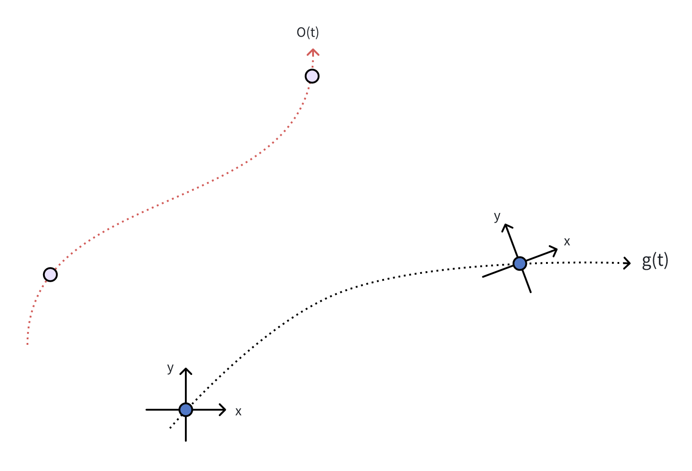

When tracking an object's position and heading, we always from the ego's perspective. However, ego's motion makes the tracking of the object a little difficult. The basic idea is doing the tracking on the world coordinate, then transforming into the ego-car's coordinate. In this post, we will discusss how to combine the ego's motion into the object's tracking concisely.

# Continuous Form

## Definitions

    

The target's movement in the world coordinate: $o(t)$; ego-car movement in the world coordinate: $g(t)$; ego-car's heading angle: $\theta(t)$; observed target's coordinate: $f(t)$.

## Continuous motion in the world coordinate

$$\mathbf{E}(t)\mathbf{x}(t) = \boldsymbol{o}(t)- \mathbf{g}(t) $$

where 

$$\mathbf{E}(t) =
\begin{bmatrix}
\cos \theta(t) & -\sin\theta(t) \\
\sin \theta(t) & \cos\theta(t)
\end{bmatrix}$$

is the basis, $\mathbf{x}(t) = [x_x(t), x_y(t)]^\top$ is the observed coordinate at time $t$ under the basis $\mathbf{E}(t)$, $\mathbf{o}(t)=[o_x(t), o_y(t)]^\top$ and $\mathbf{g}(t) = [g_x(t), g_y(t)]^\top$ are the object's and ego-car's motion in the world coordinate, respectively. Thus, the observed velocity satisfies

$$
\begin{align}
\partial \mathbf{x} = \partial \mathbf{E}^{-1} \,(\mathbf{o} - \mathbf{g}) + \mathbf{E}^{-1}\,(\partial \mathbf{o} - \partial \mathbf{g})
\end{align}
$$

$$
\begin{aligned}
\partial ^2 \mathbf{x} 
&= \partial^2 \mathbf{E}^{-1}(\mathbf{o} - \mathbf{g}) + \partial \mathbf{E}^{-1}(\partial \mathbf{o} - \partial\mathbf{g}) + \partial \mathbf{E}^{-1}(\partial \mathbf{o} - \partial \mathbf{g}) + \mathbf{E}^{-1}(\partial^2 \mathbf{o} - \partial^2\mathbf{g}) \\ 
&=\partial^2 \mathbf{E}^{-1}(\mathbf{o} - \mathbf{g}) + 2\partial \mathbf{E}^{-1}(\partial \mathbf{o} - \partial\mathbf{g}) 
+  \mathbf{E}^{-1}(\partial^2 \mathbf{o} - \partial^2\mathbf{g}) 
\end{aligned}
$$

$$
\mathbf{E} =
\begin{bmatrix}
\cos\theta  & -\sin\theta \\
\sin\theta & \cos\theta
\end{bmatrix}
$$

$$
\mathbf{E}^{-1} =
\begin{bmatrix}
\cos\theta  & \sin\theta \\
-\sin\theta & \cos\theta
\end{bmatrix}
$$,

$$
\partial\mathbf{E} = 
\partial\theta
\begin{bmatrix}
-\sin\theta & -\cos\theta \\
\cos\theta & -\sin\theta
\end{bmatrix}
$$

$$
\partial^2\mathbf{E} = 
\partial^2\theta
\begin{bmatrix}
-\sin\theta & -\cos\theta\\
\cos\theta & -\sin\theta
\end{bmatrix}
+ (\partial\theta)^2
\begin{bmatrix}
-\cos\theta & \sin\theta \\
-\sin\theta & -\cos\theta
\end{bmatrix}
$$,

$$\partial\mathbf{E}^{-1} = 
\partial\theta \cdot
\begin{bmatrix}
-\sin\theta & \cos\theta\\
-\cos\theta & -\sin\theta
\end{bmatrix}$$

$$\partial^2\mathbf{E}^{-1} =
\partial^2\theta
\begin{bmatrix}
-\sin\theta & \cos\theta \\
-\cos\theta & -\sin\theta
\end{bmatrix} +
(\partial \theta)^2
\begin{bmatrix}
-\cos\theta & -\sin\theta\\
\sin\theta & -\cos\theta
\end{bmatrix}
$$

Note that $\mathbf{E}^{-1} = \mathbf{E}^\top$, we have $\partial\mathbf{E}^{-1} = (\partial\mathbf{E}^\top) = (\partial\mathbf{E})^\top$.

$$\partial \mathbf{E} \mathbf{x} + \mathbf{E} \partial \mathbf{x} = \partial (\mathbf{o} -\mathbf{g})$$

and

$$
\partial^2\mathbf{E} \mathbf{x} + 2\partial\mathbf{E}\partial\mathbf{x} + \mathbf{E}\partial^2\mathbf{x} = \partial^2(\mathbf{o} - \mathbf{g})
$$.

## Continuous motion model

The motion ordinary differential equation (ODE) is

$$\dot{\mathbf{o}}(t) = \mathbf{A}\mathbf{o}(t) + \mathbf{n}(t)$$

where if it is a constant velocity model, we have $\mathbf{o}(t) = [s(t), \dot{s}(t)]^\top $, 

$$
\mathbf{A} = 
\begin{bmatrix}
0 & 1\\
0 & 0
\end{bmatrix}
$$

$\mathbf{n}(t) = [0, n]^\top$, and if it is a constant acceleration model we have $\mathbf{o}(t) = [s(t), \dot{s}(t), \ddot{s}(t)]^\top$, 

$$
\mathbf{A} = 
\begin{bmatrix}
0 & 1 & 0\\
0 & 0 & 1\\
0 & 0 & 0
\end{bmatrix}
$$

$\mathbf{n}(t) = [0, 0, n]^\top$.

# Discretized form

We would like to derive a recursive formula for the observations, $\mathbf{x}$. The state transition and observation functions are

$$\begin{align}
\mathbf{B}_{k-1}\mathbf{x}_{k-1} &= \mathbf{o}_{k-1} - \mathbf{g}_{k-1} \nonumber\\
\mathbf{B}_{k} \mathbf{x}_{k} &= \mathbf{o}_{k} - \mathbf{g}_{k} \nonumber\\
\mathbf{o}_{k} &= \mathbf{F}_{k}\circ\mathbf{o}_{k-1} + \mathbf{n}_k \nonumber\\
\mathbf{y}_{k} &= \mathbf{H}_{k}\mathbf{x}_{k} + \mathbf{w}_{k}
\end{align}$$

where $\mathbf{y}_{k}$ and $\mathbf{w}_{k}$ are the observation and observation noise, respectively.  "$\circ$" denotes the function composition.

We have a relationship between states in the ego-car coordinates with time $k$ and $k+1$:

$$
\mathbf{B}_{k}\mathbf{x}_{k} + \mathbf{g}_{k}= \mathbf{F}_k\circ [\mathbf{B}_{k-1}\mathbf{x}_{k-1}+ \mathbf{g}_{k-1}]+ \mathbf{n}_k
$$

Then the predicted states in the ego-car's coordinate at time $k$:

## Treat relative distance as a solid component

We can also treat the relative distance, $\mathbf{o}_k - \mathbf{g}_k$, as a whole solid component. We have

$$\mathbf{x}_k = \mathbf{B}_k^{-1}\mathbf{F}_k\mathbf{B}_{k-1}\mathbf{x}_{k-1} + \mathbf{n}_k^o + \mathbf{n}_k^g$$

where 

$$\begin{aligned}
\mathbf{F}_k\circ\mathbf{g}_{k-1} - \mathbf{g}_k  = \mathbf{n}_{g_k} 
\end{aligned}
$$

## Form of state basis

In the following, we will derive the general form for the basis of states, $\mathbf{B}$.

For a constant velocity model we have

$$
\mathbf{B} = 
\begin{bmatrix}
\mathbf{E} & \mathbf{0} \\
\partial \mathbf{E} & \mathbf{E}
\end{bmatrix}
$$

and for the constant acceleration model we have

$$
\mathbf{B} = 
\begin{bmatrix}
\mathbf{E} & \mathbf{0} & \mathbf{0} \\
\partial \mathbf{E} & \mathbf{E} & \mathbf{0} \\
\partial^2 \mathbf{E} & 2\partial\mathbf{E} & \mathbf{E}
\end{bmatrix}
$$

According to Eq. (1) and Eq. (2), for constant velocity model

$$
\mathbf{B}^{-1} = 
\begin{bmatrix}
\mathbf{E}^{-1} & \mathbf{0} \\
\partial\mathbf{E}^{-1} & \mathbf{E}^{-1}
\end{bmatrix}
$$

and for a constant acceleration model we have

$$
\mathbf{B}^{-1} = 
\begin{bmatrix}
\mathbf{E}^{-1} & \mathbf{0} & \mathbf{0} \\
\partial\mathbf{E}^{-1} & \mathbf{E}^{-1} & \mathbf{0} \\
\partial^2\mathbf{E}^{-1} & 2\partial\mathbf{E}^{-1} & \mathbf{E}^{-1}
\end{bmatrix}
$$

Since $\partial(\mathbf{E}^{-1}\mathbf{E}) = \partial\mathbf{E}^{-1}\mathbf{E} + \mathbf{E}^{-1}\partial\mathbf{E} = \mathbf{0}$, we have

$$\partial\mathbf{E} =-\mathbf{E}\partial\mathbf{E}^{-1}\mathbf{E}  =-\partial\theta
\begin{bmatrix}
0 & 1 \\
-1 & 0
\end{bmatrix}
\mathbf{E}
\triangleq
\omega
\mathbf{C}\mathbf{E} =\omega\mathbf{E}\mathbf{C}
$$

where 

$$\mathbf{C} =
\begin{bmatrix}
0 & -1 \\
1 & 0
\end{bmatrix}
$$

$\omega = \frac{\partial\theta}{\partial{t}}$, $\mathbf{C}^\top=-\mathbf{C}$, $\mathbf{C}\mathbf{C}^\top=\mathbf{I}$.

$$\partial\mathbf{E}^{-1}=-\mathbf{E}^{-1}\partial\mathbf{E} \mathbf{E}^{-1} =-\partial\theta
\begin{bmatrix}
0 & -1 \\
1 & 0
\end{bmatrix}
\mathbf{E}^{-1}
\triangleq 
\omega \mathbf{C}^{-1}\mathbf{E}^{-1} = \omega\mathbf{E}^{-1}\mathbf{C}^{-1}$$,

and

$$\partial^2\mathbf{E} = -\mathbf{E}(2\partial\mathbf{E}^{-1}\partial\mathbf{E}+ \partial^2\mathbf{E}^{-1}\mathbf{E}) = -\mathbf{E}(2\omega^2\mathbf{I} - \omega^2\mathbf{I}-\dot{\omega}\mathbf{C})
\triangleq [\dot{\omega}\mathbf{C}-\omega^2\mathbf{I}]\mathbf{E} =
\mathbf{E}[\dot{\omega}\mathbf{C}-\omega^2\mathbf{I}]$$,

$$\partial^2\mathbf{E}^{-1} = -(2\partial\mathbf{E}^{-1}\partial\mathbf{E} + \mathbf{E}^{-1}\partial^2\mathbf{E})\mathbf{E}^{-1} =-(2\omega^2\mathbf{I} -\omega^2\mathbf{I} - \partial^2\theta\mathbf{C})\mathbf{E}^{-1} 
\triangleq [\dot{\omega}\mathbf{C}^{-1} - \omega^2\mathbf{I}]
\mathbf{E}^{-1} =
\mathbf{E}^{-1} [\dot{\omega}\mathbf{C}^{-1} - \omega^2\mathbf{I}]$$.

Combine these and we can simplify

$$
\mathbf{B} = 
\text{diag}(\mathbf{E}, \mathbf{E})
\cdot
\begin{bmatrix}
\mathbf{I} & \mathbf{0} \\
\omega\mathbf{C} & \mathbf{I}
\end{bmatrix}  = \text{diag}(\mathbf{E}, \mathbf{E})\mathbf{W}$$

$$\mathbf{B}^{-1} =
\begin{bmatrix}
\mathbf{I} & \mathbf{0}\\
\omega\mathbf{C}^{-1} & \mathbf{I} 
\end{bmatrix}
\cdot
\text{diag}(\mathbf{E}^{-1}, \mathbf{E}^{-1}) =\mathbf{W}^{-1}\cdot\text{diag}(\mathbf{E}^{-1}, \mathbf{E}^{-1})
$$

for state that contains position and velocity;

$$\mathbf{B} = 
\text{diag}(\mathbf{E}, \mathbf{E}, \mathbf{E})
\cdot
\begin{bmatrix}
\mathbf{I} & \mathbf{0} & \mathbf{0}\\
\omega\mathbf{C} & \mathbf{I} & \mathbf{0} \\
\dot{\omega}\mathbf{C}-\omega^2\mathbf{I} & 2\omega\mathbf{C} & \mathbf{I}
\end{bmatrix} =
\text{diag}(\mathbf{E}, \mathbf{E}, \mathbf{E})\mathbf{W}
$$

$$\mathbf{B}^{-1} =
\begin{bmatrix}
\mathbf{I} & \mathbf{0} & \mathbf{0}\\
\omega\mathbf{C}^{-1} & \mathbf{I} &\mathbf{0}\\
\dot{\omega}\mathbf{C}^{-1}-\omega^2\mathbf{I} & 2\omega\mathbf{C}^{-1} & \mathbf{I} 
\end{bmatrix}
\cdot
\text{diag}(\mathbf{E}^{-1}, \mathbf{E}^{-1},\mathbf{E}^{-1}) = \mathbf{W}^{-1}\text{diag}(\mathbf{E}^{-1}, \mathbf{E}^{-1},\mathbf{E}^{-1})
$$

for states that contains position, velocity, and acceleration.

# Ego-pose information

In a regular system, the information of the ego-car includes: the translation, $\mathbf{t}_k$,  from $k-1$ to $k$ and the coordinate rotation matrix $\mathbf{R}_k$, or ego velocity, $\mathbf{v}_k$, the angular velocity, $\omega_k$.  Represent the ego-car's information in the world coordinate we have

$$
\mathbf{E}_k\mathbf{t}_k = \mathbf{g}_{k-1} - \mathbf{g}_{k}
,\quad
\mathbf{E}_k\mathbf{v}_k
,\quad
\mathbf{R}_k = \mathbf{E}_k^{-1}\mathbf{E}_{k-1}
$$

### Ego motion compensation

According to Eq. (4) we have&#x20;

$$\begin{aligned}
\mathbf{x}_{k} 
&= \mathbf{B}_{k}^{-1} [\mathbf{F}_k\circ(\mathbf{B}_{k-1}\mathbf{x}_{k-1} +\mathbf{g}_{k-1}) - \mathbf{g}_{k} + \mathbf{n}_k] \\
&= 
\mathbf{B}^{-1}_{k}
\left( \mathbf{F}_k\circ(\mathbf{B}_{k-1}\mathbf{x}_{k-1}) + \mathbf{F}_{k}\circ\mathbf{g}_{k-1} - \mathbf{g}_{k}+ \mathbf{n}_k \right) 
\end{aligned}$$

And assume the ego motion has the same motion pattern as for the object, then we have

$$
\begin{aligned}
\mathbf{F}_k\circ\mathbf{g}_{k-1} - \mathbf{g}_k  = \mathbf{n}_{g_k} 
\end{aligned}
$$

where $\mathbf{n}_{g_k}$ is the process noise for the ego-car at time $k$.

# Object part in the motion model

The part that involves the object in the motion model is $\mathbf{B}_k^{-1}\mathbf{F}_k\circ\mathbf{B}_{k-1}\mathbf{x}_{k-1}$. Substitute the expression of $\mathbf{B}_k^{-1}$ we have

$$
\begin{aligned}
\mathbf{B}_k^{-1}\mathbf{F}_k\circ(\mathbf{B}_{k-1}\mathbf{x}_{k-1}) 
&\overset{(a)}{=} \mathbf{W}_k^{-1}\cdot\text{diag}(\mathbf{E}_{k}^{-1}, \mathbf{E}_{k}^{-1}, \cdots) \cdot \mathbf{F}_k \cdot\text{diag}(\mathbf{E}_{k-1}, \mathbf{E}_{k-1}, \cdots)\mathbf{W}_{k-1}\mathbf{x}_{k-1} \\
&\overset{(b)}{=} \mathbf{W}_k^{-1}\text{diag}(\mathbf{R}_k, \mathbf{R}_k, \cdots)\mathbf{F}_k\mathbf{W}_{k-1}\mathbf{x}_{k-1} \\
&\overset{(c)}{=} 
\mathbf{W}_k^{-1}\mathbf{F}_k\text{diag}(\mathbf{R}_k, \mathbf{R}_k, \cdots)\mathbf{W}_{k-1}\mathbf{x}_{k-1}\\
&\overset{(d)}{=}
\bar{\mathbf{R}}_k\mathbf{W}_k^{-1}\mathbf{F}_k\mathbf{W}_{k-1}\mathbf{x}_{k-1}\\
&\triangleq\bar{\mathbf{R}}_k\hat{\mathbf{F}}_k\mathbf{x}_{k-1} 
\end{aligned}
$$

where $\mathbf{R}_k = \mathbf{E}_k^{-1}\mathbf{E}_{k-1} = \mathbf{E}(\theta_{k-1} - \theta_k)$, $\bar{\mathbf{R}}_k = \text{diag}(\mathbf{R}_k, \cdots)$, (a) established by substitute $\mathbf{F}_k\circ$ by its matrix formular, $\mathbf{F}_k\cdot$, (b) and (c) substatiates due to the assumption that $\bar{\mathbf{R}}\mathbf{F} = \mathbf{F}\bar{\mathbf{R}}$, which is true for a constant velocity or constant acceleration model, (d) is true as a result of $\bar{\mathbf{R}}\mathbf{W}^{-1}=\mathbf{W}^{-1} \bar{\mathbf{R}}$. It indicates that the order of following motion model and rotate coordinate does not matter. We can formulate the motion model only depending on the relative rotation because we can exchange the motion and the coordinate.

# Conclusion

The complete Kalman filter with ego-motion compensation is as follows:

1. Do prediction with pseudo motion matrix,

   1. Subtract the ego rotation

   2. Follow motion model

   3. Add ego rotation

   4. Rotate

2. Compensate the ego-motion

3. Do correction as in traditional Kalman filter.

# Applications

## Static object position tracking

For a static object, its position does not change. So, the motion matrix is

$\mathbf{F} = \mathbf{I}$, and $\mathbf{W}=\mathbf{I}$.

We have $\hat{\mathbf{F}}_k = \mathbf{R}_k$. So that

$$
\mathbf{x}_k =\mathbf{R}_k \mathbf{x}_{k-1} + \mathbf{B}_k^{-1}\mathbf{n}_{g_k} + \mathbf{n}_k
$$

where $\mathbf{n}_{g_k} \sim\mathcal{N}(\mathbf{g}_{k-1} - \mathbf{g}_k=\mathbf{B}_k\mathbf{t}, *)$. Thus, we get

$$
\mathbf{x}_k =\mathbf{R}_k\mathbf{x}_{k-1} + \mathbf{t} + \mathbf{n}_k
$$

It means, in this case, we need to compensate for the relative translation and rotation.

## Constant velocity object position tracking

### The pseudo motion matrix

$$
\begin{aligned}
\hat{\mathbf{F}}_k 
&=\bar{\mathbf{W}}_k^{-1}\mathbf{F}_k\mathbf{W}_{k-1} \\
&= \mathbf{F}_k + 
\begin{bmatrix}
\Delta{t}\omega_{k-1}\mathbf{C} & \mathbf{0} \\
\Delta{t}\omega_k\omega_{k-1}\mathbf{I} + (\omega_{k-1}-\omega_k)\mathbf{C} & -\Delta{t}\omega_k\mathbf{C}
\end{bmatrix} \\
&\overset{(a)}{=}\mathbf{F}_k + 
\Delta{\theta}
\begin{bmatrix}
\mathbf{I} & \mathbf{0} \\
-\omega_k\mathbf{C} & -\mathbf{I}
\end{bmatrix}
\begin{bmatrix}
\mathbf{C} & \mathbf{0} \\
\mathbf{0} & \mathbf{C}
\end{bmatrix}
\end{aligned}
$$

where (a) is true with assumption $\omega_k = \omega_{k-1}$. The second term which involves the rotated angle is usually ignored by others.

The complete form

$$\mathbf{F}_k + \left[\begin{matrix}0 & - \Delta{t} \omega_{k-1} & 0 & 0\\\Delta{t} \omega_{k-1} & 0 & 0 & 0\\\Delta{t} \omega_{k-1} \omega_{k} & - \omega_{k-1} + \omega_{k} & 0 & \Delta{t}\omega_{k}\\\omega_{k-1} - \omega_{k} & \Delta{t} \omega_{k-1} \omega_{k} & - \Delta{t} \omega_{k} & 0\end{matrix}\right]$$

### The ego-motion part

1. If we assume ego motion is at constant velocity, $$\mathbf{F}_k\mathbf{g}_{k-1}- \mathbf{g}_k =\mathbf{0}$$

2. If we assume ego motion is at constant acceleration, $$\mathbf{F}_k\mathbf{g}_{k-1} - \mathbf{g_k}\sim\mathcal{N}(0.5*\Delta{t}^2, *)$$

The results are interesting, which are counter intuitive at first glance. We do not need to account for ego-motion.&#x20;

## Constant acceleration object position tracking

### The pseudo motion matrix

With the assumption that $\dot{\omega}_k = 0$, $\dot{\omega}_{k-1}=0$, and $\omega_k = \omega_{k-1}$:

$$\begin{aligned}
\hat{\mathbf{F}}_k 
&=\bar{\mathbf{W}}_k^{-1}\mathbf{F}_k\mathbf{W}_{k-1} \\
&= \mathbf{F}_k + 
\Delta{\theta}
\begin{bmatrix}
-0.5\Delta{\theta} & -1 & 0 & -\Delta{t} & 0 & 0 \\
1 & -0.5\Delta{\theta} & \Delta{t}& 0&0 &0\\
0 & -0.5\Delta{\theta}\omega & \Delta{\theta} & -1& 0& 0.5\Delta{t}\\
0.5\Delta{\theta}\omega & 0 & 1 & \Delta{\theta} & -0.5\Delta{t} & 0\\
0.5\Delta{\theta}\omega^2 & -\omega^2 & 3\omega & \Delta{\theta}\omega & -0.5\Delta{\theta}& 2 \\
\omega^2 & 0.5\Delta{\theta}\omega^2 & -\Delta{\theta}\omega & 3\omega & -2 & -0.5\Delta{\theta}
\end{bmatrix} \\
&=
\mathbf{F}_k + 
\Delta{\theta}\begin{bmatrix}
-0.5\Delta{\theta}\mathbf{I} + \mathbf{C} & \Delta{t}\mathbf{C} & \mathbf{0} \\
0.5\Delta{\theta}\mathbf{C} & \Delta{\theta}\mathbf{I} + \mathbf{C} & -0.5\Delta{t}\mathbf{C} \\
-\omega^2\mathbf{C}+0.5\Delta{\theta}\omega^2\mathbf{I} & 3\omega\mathbf{I}-\Delta{\theta}\omega\mathbf{C} & -0.5\Delta{\theta}\mathbf{I}-2\mathbf{C}
\end{bmatrix} \\
&=
\mathbf{F}_k + 
\Delta{\theta}
\begin{bmatrix}
0.5\Delta{\theta}\mathbf{C} + \mathbf{I} & \Delta{t}\mathbf{I} & \mathbf{0} \\
0.5\Delta{\theta}\mathbf{I} & -\Delta{\theta}\mathbf{C} + \mathbf{I} & -0.5\Delta{t}\mathbf{I} \\
-\omega^2\mathbf{I}-0.5\Delta{\theta}\omega^2\mathbf{C} & -3\omega\mathbf{C} - \Delta{\theta}\omega\mathbf{I} & 0.5\Delta{\theta}\mathbf{C} - 2\mathbf{I} 
\end{bmatrix}
\cdot \text{diag}(\mathbf{C}, \mathbf{C}, \mathbf{C})
\end{aligned}$$

The complete form (calculated by sympy):

$$
\mathbf{F}_k + \left[\begin{matrix}- 0.5 dt^{2} w_{1}^{2} & dt \left(- 0.5 dt dw_{1} - w_{1}\right) & 0 & - 1.0 dt^{2} w_{1} & 0 & 0\\dt \left(0.5 dt dw_{1} + w_{1}\right) & - 0.5 dt^{2} w_{1}^{2} & 1.0 dt^{2} w_{1} & 0 & 0 & 0\\dt \left(0.5 dt dw_{1} w_{2} - w_{1}^{2} + w_{1} w_{2}\right) & - 0.5 dt^{2} w_{1}^{2} w_{2} - dt dw_{1} - w_{1} + w_{2} & 1.0 dt^{2} w_{1} w_{2} & dt \left(- 2 w_{1} + w_{2}\right) & 0 & 0.5 dt^{2} w_{2}\\0.5 dt^{2} w_{1}^{2} w_{2} + dt dw_{1} + w_{1} - w_{2} & dt \left(0.5 dt dw_{1} w_{2} - w_{1}^{2} + w_{1} w_{2}\right) & dt \left(2 w_{1} - w_{2}\right) & 1.0 dt^{2} w_{1} w_{2} & - 0.5 dt^{2} w_{2} & 0\\dt dw_{1} \cdot \left(0.5 dt dw_{2} + 2 w_{2}\right) + w_{1}^{2} \cdot \left(0.5 dt^{2} w_{2}^{2} - 1\right) + w_{1} \left(dt dw_{2} + 2 w_{2}\right) - w_{2}^{2} & - dt w_{1}^{2} \cdot \left(0.5 dt dw_{2} + 2 w_{2}\right) + dt w_{1} w_{2}^{2} + dw_{1} \cdot \left(0.5 dt^{2} w_{2}^{2} - 1\right) + dw_{2} & dt \left(2 w_{1} \cdot \left(0.5 dt dw_{2} + 2 w_{2}\right) - w_{2}^{2}\right) & dt dw_{2} + 2 w_{1} \cdot \left(0.5 dt^{2} w_{2}^{2} - 1\right) + 2 w_{2} & - 0.5 dt^{2} w_{2}^{2} & dt \left(0.5 dt dw_{2} + 2 w_{2}\right)\\dt w_{1}^{2} \cdot \left(0.5 dt dw_{2} + 2 w_{2}\right) - dt w_{1} w_{2}^{2} - dw_{1} \cdot \left(0.5 dt^{2} w_{2}^{2} - 1\right) - dw_{2} & dt dw_{1} \cdot \left(0.5 dt dw_{2} + 2 w_{2}\right) + w_{1}^{2} \cdot \left(0.5 dt^{2} w_{2}^{2} - 1\right) + w_{1} \left(dt dw_{2} + 2 w_{2}\right) - w_{2}^{2} & - dt dw_{2} - 2 w_{1} \cdot \left(0.5 dt^{2} w_{2}^{2} - 1\right) - 2 w_{2} & dt \left(2 w_{1} \cdot \left(0.5 dt dw_{2} + 2 w_{2}\right) - w_{2}^{2}\right) & dt \left(- 0.5 dt dw_{2} - 2 w_{2}\right) & - 0.5 dt^{2} w_{2}^{2}\end{matrix}\right]$$

# Summary

In ego-motion compensation, if the motion model of the object and ego-car is different, we need to compensate for ego-motion. Otherwise, we do not need to. We also need the basis rotation angle, $\theta$, rotation rate, $\omega$, and rotation acceleration, $\dot{\omega}$.

# Pitfalls

One may try to estimate the state of the object in the world coordinate, which means

$$\begin{aligned}
\mathbf{E}_k \mathbf{y}_k + \mathbf{g}_k &= \mathbf{H}_k \mathbf{x}_k +\mathbf{w}_k \\
\mathbf{x}_k &= \mathbf{F}_k \mathbf{x}_{k-1} + \mathbf{n}_k
\end{aligned}$$

One first converts the current observed coordinate to the world coordinate by doing $\mathbf{E}_k\mathbf{y}_k + \mathbf{g}_k$, then doing the ordinary Kalman updates. Finally, converts the estimate hidden state by $\mathbf{E}_k^\top[ \hat{\mathbf{x}}_{k} - \hat{\mathbf{g}}_k]$, where $\hat{\mathbf{x}}_k$is the updated states in the world coordinate and $\hat{\mathbf{g}}_k = [ \mathbf{g}_k, \mathbf{0}]^\top$. However, this method is wrong. Because we can not directly transform the other states (velocity, acceleration, etc.) by simply duplicate operations as in the position transform. As shown in Eq. (1) and Eq. (2), the transformation of velocity and acceleration not only depends on the rotation matrix, it also depends on other attributes of the ego-poses.
