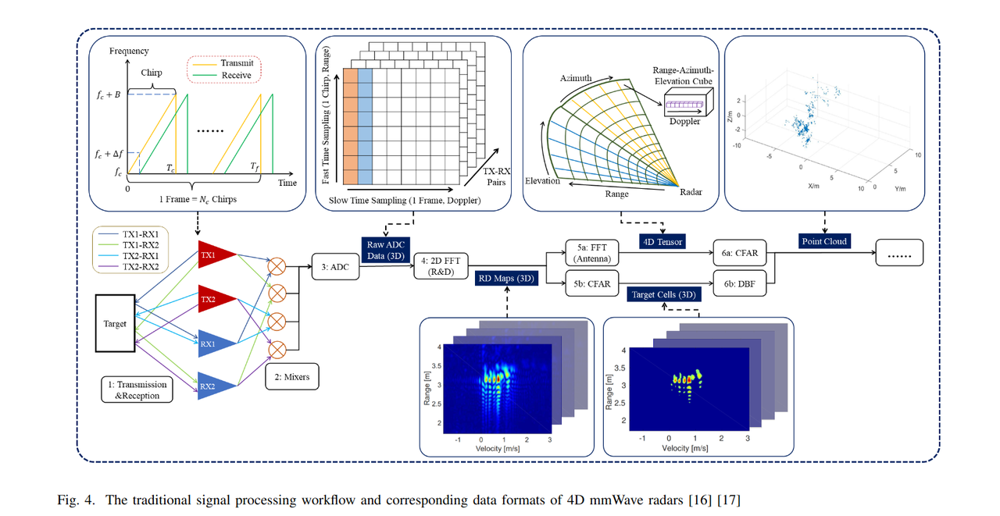

# System Diagram

See Appendix.VII

    
    
Figure 1: System diagram of a typical 4D mmWave radar signal processing chain (figure from [1])

# Single Object Tx-Rx Model

Below is a mathematical formalization of each major step in the traditional 4D mmWave Frequency Modulated Continuous Wave (FMCW) radar signal processing chain, from transmitted signals through to point-cloud generation. Please note that these equations represent a general framework; actual implementations may vary slightly depending on specific system parameters and design choices.

**Notation and Definitions:**

* $f_c$: Carrier frequency of the radar.

* $B$: Bandwidth swept by each chirp.

* $T_c$: Chirp duration (time taken to sweep the bandwidth B).

* $T_f$: Frame duration (consisting of $N_c$ chirps).

* $N_c$: Number of chirps per frame.

* $M$: Number of samples per chirp (fast-time samples).

* $N$: Number of slow-time samples (across chirps), typically equals $N_c$.

* $P$: Number of virtual antenna elements (after combining Tx-Rx pairs).

* $\lambda$: Wavelength of the radar signal.

* $d$: Spacing between adjacent virtual antenna elements.

* $j=\sqrt{-1}$.

***

## Transmitted FMCW Chirp Signal

A single FMCW chirp can be modeled as a complex exponential with a time-varying instantaneous frequency:

$$s_{\text{TX}}(t) = A_{\text{TX}} e^{j2\pi \left( f_c t + \frac{B}{2T_c} t^2 \right)} \quad \text{for } t \in [0, T_c]$$

For a frame of $N_c$ chirps, each chirp is repeated with a period $T_f = N_c T_c$ (neglecting idle times for simplicity):

$$s_{\text{TX,frame}}(t) = \sum_{n=0}^{N_c-1} s_{\text{TX}}(t - nT_c) u(t - nT_c) $$

where $u(t)$ is the unit step function ensuring the waveform is only defined during each chirp interval.

***

## Target Reflection and Received Signal

Assume one point target at range $R$ moving with radial velocity $v$. The received signal from that target after reflection is delayed and Doppler shifted:

$$s_{\text{RX}}(t) = A_{\text{RX}} e^{j2\pi \left(f_c (t - \tau) + \frac{B}{2T_c} (t - \tau)^2 \right)} e^{j2\pi f_D t}$$

where

* $\tau = \frac{2R}{c}$ is the round-trip delay (with $c$ the speed of light),

* $f_D = \frac{2v}{\lambda}$ is the Doppler frequency due to target motion, where $v>0$ indicates the target is approaching the radar (higher received frequency); $v<0$ denotes the target is moving away from the radar (lower received frequency).

In practice, multiple targets sum linearly:

$$s_{\text{RX}}(t) = \sum_{\ell} A_{\ell} e^{j2\pi \left( f_c (t - \tau_{\ell}) + \frac{B}{2T_c} (t - \tau_{\ell})^2 \right)} e^{j2\pi f_{D,\ell} t}$$

Please refer Appendix.II for the meaning of $A_\ell$.

***

## Mixing and Downconversion

The received signal (Appendix.III) is mixed with a replica of the transmitted chirp (local oscillator, LO):

$$s_{\text{IF}}(t) = s_{\text{RX}}(t)\cdot s_{\text{LO}}^*(t)$$

where $s^*_{LO}$ indicates the conjugate of $s_{LO}$.

Let $s_{\text{LO}}(t) = e^{j2\pi (f_c t + \frac{B}{2T_c}t^2)}$

Then:

$$s_{\text{IF}}(t) = \sum_{\ell} A_{\ell} e^{j2\pi\left( (f_c(t-\tau_\ell)+\frac{B}{2T_c}(t-\tau_\ell)^2 + f_{D,\ell} t) - (f_c t + \frac{B}{2T_c} t^2) \right)}$$

After simplification (assuming $\tau_\ell$ and Doppler are small relative to the chirp period see Appendix.IV):

$$s_{\text{IF}}(t) \approx \sum_{\ell} A_{\ell} e^{-j2\pi \left( f_{R,\ell} t \right)} e^{j2\pi f_{D,\ell} t}$$

Where $f_{R,\ell} = \frac{2 B R_{\ell}}{c T_c}$ is the beat frequency related to target range.

Thus the IF signal carries range (beat frequency) and Doppler (phase change across chirps) information.

***

## ADC Sampling and Data Cube Formation

The IF signal is sampled at a rate $f_s=\frac{1}{T_s}$ yielding discrete samples for each chirp. For the $p$-th antenna element, the $m$-th sample in the $n$-th chirp is:

$$x[m,n,p] = s_{\text{IF},p}(mT_s + nT_c)$$

with $m = 0,\dots,M-1$; $n = 0,\dots,N_c-1$; $p = 0,\dots,P-1$.

This forms a 3D data cube:

* Fast-time (range dimension): $m$

* Slow-time (Doppler dimension): $n$

* Antenna (spatial dimension): $p$

***

## Range-Doppler Processing

Why they are called range FFT and doppler FFT (Appendix.V)

**Range FFT**:
We apply an M-point FFT along the fast-time dimension to transform from time samples to frequency (range) domain:

$$X_{\text{range}}[k,n,p] = \sum_{m=0}^{M-1} x[m,n,p] e^{-j\frac{2\pi k m}{M}}, \quad k=0,\dots,M-1$$

Each k-index corresponds to a particular range bin.

**Doppler FFT**:
Then, we apply an N-point FFT along the slow-time (chirp) dimension to extract Doppler information:

$$X_{\text{RD}}[k,l,p] = \sum_{n=0}^{N-1} X_{\text{range}}[k,n,p] e^{-j\frac{2\pi l n}{N}}, \quad l=0,\dots,N-1$$

Each l-index corresponds to a Doppler bin (velocity).

This produces a Range-Doppler (RD) map for each antenna $p$.

***

## Angle Estimation (Spatial FFT or Beamforming)

To estimate angle, we use the antenna array. If the p-th antenna element is located at $d_p = p \cdot d$, the received signal for a target at angle $\theta$ has a phase progression:

$$X_{\text{RDA}}[k,l,\theta] = \sum_{p=0}^{P-1} X_{\text{RD}}[k,l,p] w_p(\theta) e^{-j \frac{2\pi}{\lambda} d_p \sin(\theta)}$$

Here:

* $w_p(\theta)$ are optional beamforming weights.

* By performing an P-point FFT over p instead of a sum over a continuous angle, we discretize angles into angular bins. For a uniform linear array (ULA):

$$X_{\text{RDA}}[k,l,q] = \sum_{p=0}^{P-1} X_{\text{RD}}[k,l,p] e^{-j\frac{2\pi}{P} p q}$$

where q indexes discrete angle bins. Similar extensions are made for elevation using a 2D antenna array, resulting in a 4D cube: (Range, Doppler, Azimuth, Elevation).

***

## CFAR Detection

A Constant False Alarm Rate (CFAR) detector sets a threshold based on local noise statistics. For each cell $(k,l,q)$ in the RDA cube, we estimate noise power from a neighboring window and set a threshold:

$$T(k,l,q) = \alpha \cdot \hat{\sigma}^2(k,l,q)$$

where $\hat{\sigma}^2$ is the estimated noise variance and $\alpha$ a scaling factor based on desired false alarm probability. A detection occurs if:

$$|X_{\text{RDA}}[k,l,q]|^2 > T(k,l,q)$$

***

## Digital Beamforming (DBF)&#x20;

(Appendix.VIII)

If we use a weighting vector $\mathbf{w}$ (e.g., minimum variance distortionless response (MVDR) or other beamformer):

$$X_{\text{RDA}}[k,l,\theta] = \mathbf{w}^H(\theta) \mathbf{X}_{\text{RD}}[k,l]$$

where $\mathbf{X}_{\text{RD}}[k,l]$ is the vector of RD samples across antennas (Appendix.IX) and $\mathbf{w}(\theta)$ is chosen to form a beam in the direction $\theta$.

***

## Point Cloud Generation

After detection, we convert range $R_k$, angle $\theta_q$ (and $\phi$ if elevation is considered), and Doppler $v_l$ bins into Cartesian coordinates:

$$x = R_k \cos(\theta_q) \cos(\phi), \quad y = R_k \sin(\theta_q) \cos(\phi), \quad z = R_k \sin(\phi)$$

Velocity can be derived from Doppler frequency ():

$$v = \frac{\lambda l}{2N T_c}$$

Each detected cell forms a point in the 3D space with an associated velocity, resulting in a point cloud:

$$\mathcal{P} = \{(x_i, y_i, z_i, v_i) \mid \text{CFAR detection holds}\}$$

***

## **In summary**

1. **Transmission & Reception:** Defined by chirp signals and their reflections.

2. **Mixing & Downconversion:** Produces IF signals with range-Doppler information encoded as beat frequencies and slow-time phase shifts.

3. **Sampling & Data Cube Formation:** $$x[m,n,p]$$ samples form a 3D tensor.

4. **Range & Doppler FFTs:** Convert time-domain samples into range-Doppler spectra: $X_{\text{RD}}[k,l,p]$.

5. **Angle Estimation:** Spatial processing (FFT or beamforming) yields $X_{\text{RDA}}[k,l,q]$, a 4D data cube (range, Doppler, azimuth, elevation).

6. **CFAR Detection:** Sets thresholds and identifies target cells.

7. **Point Cloud Generation:** Converts detected bins into Cartesian coordinates and velocities.

# Extend to MIMO System&#x20;

When extended to MIMO system, the signal transmitted via different antennas are orthogonal. So, problem will be simplified into the trans-receiver pair problem as we have discussed before.&#x20;

# Appendix

## I: The transmitted signal&#x20;

The factor $$\frac{B}{2T_c}$$ appears in the **phase term** of the transmitted FMCW signal because of the integral relationship between frequency and phase.

### **Detailed Explanation:**

1. **Instantaneous Frequency vs. Phase:** A linear frequency-modulated (chirp) signal sweeps from a starting frequency $f_c$ to $f_c + B$ over a duration $T_c$. The instantaneous frequency $f(t)$ of such a chirp is usually defined as:

$$f(t) = f_c + \frac{B}{T_c} t \quad \text{for } 0 \leq t \leq T_c$$

* **From Frequency to Phase:** The transmitted signal $$s_{\text{TX}}(t)$$ in complex exponential form can be written as:

$$s_{\text{TX}}(t) = A_{\text{TX}} e^{j \phi(t)}$$

Since $f(t) = f_c + \frac{B}{T_c} t$, the angular frequency is:

$$\omega(t) = 2 \pi \left( f_c + \frac{B}{T_c} t \right)$$

* **Integrating to Get Phase:** The phase $\phi(t)$ is given by:

$$\phi(t) = \int_0^t \omega(\tau) d\tau = \int_0^t 2\pi \left( f_c + \frac{B}{T_c}\tau \right) d\tau.$$

Performing the integration:

$$\phi(t) = 2\pi \left( f_c t + \frac{B}{T_c} \frac{t^2}{2} \right) = 2\pi f_c t + 2\pi \frac{B}{2T_c} t^2$$

* **Resulting Phase Expression:** After integration, the phase term associated with the chirp’s frequency sweep has a quadratic component $\frac{B}{2T_c} t^2$, not $\frac{B}{T_c} t^2$. The factor of $\frac{1}{2}$ emerges naturally from the integral of a linear function.

Thus the transmitted signal is:

$$s_{\text{TX}}(t) = A_{\text{TX}} e^{j2\pi \left( f_c t + \frac{B}{2T_c} t^2 \right)}$$

### **In summary**

* The slope of the frequency is $\frac{B}{T_c}$.

* The phase is the integral of frequency over time.

* Integrating a linearly increasing frequency (which goes as $f(t) = f_c + (B/T_c) t$) introduces a factor of $1/2$ in front of the $t^2$ term.

This is why the phase term has $\frac{B}{2T_c}$ rather than $\frac{B}{T_c}$.

## II: The received amplitude

In the context of the received radar signal model, $A_\ell$ represents the complex amplitude corresponding to the $\ell$-th target’s reflected signal. Specifically, it encapsulates all the gain, attenuation, and reflectivity factors associated with that particular target, including:

1. **Target Reflectivity (Radar Cross Section, RCS):**
   Different targets reflect radar waves differently depending on their shape, orientation, and material properties. A larger or more reflective target will contribute a higher amplitude return.

2. **Propagation Losses:**
   The signal undergoes attenuation while traveling to the target and back. The amplitude decreases with range and is also influenced by atmospheric conditions.

3. **Antenna Gain Patterns:**
   The gain of the transmitting and receiving antennas in the direction of the target affects the amplitude of the received signal. Targets that lie in the main lobe of the antenna pattern will produce larger amplitude returns than those in sidelobes.

4. **Channel and System Factors:**
   The receiver’s front-end gain, noise figure, and other hardware elements also factor into the effective amplitude captured in $A_\ell$.

In essence, $A_\ell$ combines all these effects into a single complex scalar that, when multiplied by the phase term of the $\ell$-th target’s return, gives the overall contribution of that target’s echo to the received signal.

## III: Intermediate Frequency

"IF" stands for **Intermediate Frequency;** in radar and other RF systems, the signal received at the antenna is typically at the original (or a very high) carrier frequency. Before it is sampled or digitized, it is mixed with a locally generated reference signal to shift it down to a lower, more manageable frequency range called the intermediate frequency. This process simplifies subsequent signal processing steps such as filtering, amplification, and analog-to-digital conversion.

So, $s_{IF}(t)$ refers to the received radar signal after it has been mixed (downconverted) from the original RF (radio frequency) carrier down to an intermediate frequency.

## IV: Simplify the intermediate signal

When deriving the IF signal and inserting the time delay $\tau_\ell$ and Doppler term $f_{D,\ell}$, the expression initially appears complicated because of the quadratic term in $2(t-\tau_\ell)^2$. The phrase "assuming $\tau_\ell$ and Doppler are small relative to the chirp period" refers to making reasonable approximations that drop very small second-order terms, leaving only the dominant, physically meaningful components.

**Step-by-Step Detail:**

1. **Starting Point:** After mixing the received signal with the local oscillator (LO), we had something like:

$$s_{\text{IF}}(t) = \sum_{\ell} A_{\ell} \exp\left\{ j2\pi \left[ f_c (t-\tau_\ell) + \tfrac{B}{2T_c}(t-\tau_\ell)^2 + f_{D,\ell} t - \left(f_c t + \tfrac{B}{2T_c} t^2\right) \right] \right\}$$

* **Expand the Quadratic Term:** Expand $(t - \tau_\ell)^2 = t^2 - 2t\tau_\ell + \tau_\ell^2$. Substituting this in gives:

$$f_c(t-\tau_\ell) + \tfrac{B}{2T_c}(t-\tau_\ell)^2 = f_c t - f_c \tau_\ell + \tfrac{B}{2T_c}(t^2 - 2t\tau_\ell + \tau_\ell^2)$$

* **Combine Terms:** Now, the exponent inside the summation becomes:

$$f_c t - f_c \tau_\ell + \frac{B}{2T_c}(t^2 - 2t\tau_\ell + \tau_\ell^2) + f_{D,\ell} t - f_c t - \frac{B}{2T_c} t^2$$

Notice that $f_c t$ and $-f_c t$ cancel. Also, $\frac{B}{2T_c} t^2$ and $-\frac{B}{2T_c} t^2$ cancel. After these cancellations, we have:

$$- f_c \tau_\ell + \frac{B}{2T_c}(- 2t\tau_\ell + \tau_\ell^2) + f_{D,\ell} t$$

his simplifies to:

$$- f_c \tau_\ell - \frac{B}{T_c} t \tau_\ell + \frac{B}{2T_c}\tau_\ell^2 + f_{D,\ell} t$$

* **Applying the "Small" Assumptions:** The main assumptions are:

  * $\tau_\ell = \frac{2R_\ell}{c}$ is small compared to the chirp duration $T_c$. This means $\tau_\ell^2$ (a second-order small term) is even smaller and can be neglected.

  * The Doppler frequency $f_{D,\ell}$ is typically much smaller than the chirp’s instantaneous bandwidth spread $\frac{B}{T_c}$, so its influence within a single chirp period is limited to a nearly linear phase term $f_{D,\ell} t$.

By neglecting $\tau_\ell^2$, we discard:

$$\frac{B}{2T_c}\tau_\ell^2 \approx 0$$

Thus, we have:

$$s_{\text{IF}}(t) \approx \sum_{\ell} A_{\ell} e^{j2\pi \left(- f_c \tau_\ell - \frac{B}{T_c} t \tau_\ell + f_{D,\ell} t \right)}$$

This can be rearranged as:

$$s_{\text{IF}}(t) \approx \sum_{\ell} A_{\ell} e^{-j2\pi f_c \tau_\ell} e^{-j2\pi \left( \frac{B}{T_c} \tau_\ell \right) t} e^{j2\pi f_{D,\ell} t}$$

* **Defining the Range Frequency&#x20;**$f_{R,\ell}$:

Recall that $\tau_\ell = \frac{2 R_\ell}{c}$. By defining:

$$f_{R,\ell} = \frac{B}{T_c}\tau_\ell = \frac{B}{T_c}\cdot \frac{2R_\ell}{c}$$

we identify the term $\frac{B}{T_c}\tau_\ell$ as the "beat frequency" associated with the target’s range. Now the equation becomes:

$$s_{\text{IF}}(t) \approx \sum_{\ell} A_{\ell} e^{-j2\pi f_c \tau_\ell} e^{-j2\pi f_{R,\ell} t} e^{j2\pi f_{D,\ell} t}$$

* **Absorbing Constant Phase into Amplitude:**

The factor $e^{-j2\pi f_c \tau_\ell}$ is a constant phase term (does not depend on t). Such a constant phase can be absorbed into the amplitude $A_{\ell}$ since amplitudes in complex notation can carry both magnitude and phase information. Define:

$$A_{\ell}' = A_{\ell} e^{-j2\pi f_c \tau_\ell}$$

With this redefinition, we have:

$$s_{\text{IF}}(t) \approx \sum_{\ell} A_{\ell}' e^{-j2\pi f_{R,\ell} t} e^{j2\pi f_{D,\ell} t}$$

* **Final Form:**

Combining the exponential terms for range and Doppler, we arrive at:

$$s_{\text{IF}}(t) \approx \sum_{\ell} A_{\ell}' e^{-j2\pi f_{R,\ell} t} e^{j2\pi f_{D,\ell} t}$$

## V: Rang and doppler FFT

**Why "Range FFT"?**
The first FFT, commonly referred to as the **Range FFT**, is performed along the fast-time axis (the time samples within a single chirp). In an FMCW radar system, each chirp sweeps linearly in frequency over a bandwidth B. When this transmitted chirp is reflected by a target at some range R, the received echo is time-delayed by $\tau = \frac{2R}{c}$. Mixing the received signal with the transmitted chirp produces a beat frequency $f_{b}$ proportional to that delay, and hence proportional to the target’s range. Specifically, the relationship is:

$$f_{b} \approx \frac{2B}{cT_c} R$$

where $c$ is the speed of light and $T_c$ is the chirp duration.

When you take a Fourier Transform (FFT) of the time-domain samples of the IF (intermediate frequency) signal within one chirp, you convert these samples from time domain into frequency domain. Each frequency bin corresponds to a potential beat frequency $f_{b}$, and thus directly maps to a range bin. Hence, the first FFT is called the **Range FFT** because performing it reveals the target’s range information.

**Why "Doppler FFT"?**
The second FFT, known as the **Doppler FFT**, is applied along the slow-time axis. Slow-time refers to the sequence of successive chirps within a radar frame. If a target is moving, the small changes in the echo’s phase or frequency from one chirp to the next encode the Doppler shift $f_{D}$. The Doppler shift is related to the target’s radial velocity $v$ as:

$$f_{D} = \frac{2v}{\lambda}$$

where $\lambda$ is the radar wavelength.

By taking an FFT across multiple chirps (the slow-time dimension), you transform from the time domain (sequence of returns over chirps) into the Doppler frequency domain. Each bin in this Doppler spectrum corresponds to a different velocity. Thus, the second FFT is called the **Doppler FFT**, as performing it reveals the velocity (Doppler) information of the targets.

### **How Range and Doppler Are Encoded:**

1. **Range Encoding (Fast-Time Dimension):**
   &#x20;Within a single chirp, the time delay to a target introduces a beat frequency after mixing. This beat frequency is directly tied to the target’s range. Thus, the "fast-time" samples encode range information. Taking the FFT along this axis converts time samples into frequency bins that represent different ranges.

2. **Doppler Encoding (Slow-Time Dimension):**
   &#x20;Across multiple chirps, a moving target causes a slight phase shift in each subsequent echo. Over many chirps, these phase changes manifest as a sinusoidal variation in the slow-time domain. Taking an FFT across the slow-time samples converts these variations into a Doppler frequency. This Doppler frequency bin corresponds to the target’s radial velocity. Thus, the "slow-time" samples encode Doppler (velocity) information.

### **In Summary**

* The first FFT ("Range FFT") extracts range by turning per-chirp time-domain samples into a frequency spectrum where each frequency bin corresponds to a certain range.

* The second FFT ("Doppler FFT") extracts velocity by turning the sequence of echoes over multiple chirps into a frequency spectrum where each frequency bin corresponds to a certain radial velocity.

## VI: Velocity Derivation

$$v = \frac{\lambda l}{2N T_c}$$

relates the target’s radial velocity $v$ to the Doppler bin index $l$, where $\lambda$ is the radar wavelength, $N$ is the number of chirps per frame used in the Doppler FFT, and $T_c$ is the chirp duration (or the pulse repetition interval when considering one chirp per interval).

### **Derivation Steps**

1. **Definition of Doppler Frequency:**
   A moving target induces a Doppler frequency shift $f_D$ in the radar signal. For a target moving directly along the radar’s line-of-sight, the Doppler frequency is given by:

$$f_D = \frac{2v}{\lambda}$$

Here, $v$ is the target’s radial velocity and $\lambda$ is the radar wavelength. The factor of 2 comes from the round-trip nature of the radar measurement (signal going to the target and reflecting back).

* **Doppler FFT and Frequency Bins:**
  The Doppler FFT is typically computed over $N$ chirps in a frame. The time between consecutive chirps is $T_c$. Thus, the total frame duration for Doppler processing is approximately:

$$T_{\text{frame}} = N T_c$$

When you take an N-point FFT over these N slow-time samples, the Doppler frequency resolution (the spacing between adjacent Doppler frequency bins) is:

$$\Delta f_D = \frac{1}{N T_c}$$

This means that each Doppler bin index $l$ (ranging from $l = 0, 1, \ldots, N-1$) corresponds to a Doppler frequency:

$$f_{D,l} = l \Delta f_D = \frac{l}{N T_c}$$

* **Relating Doppler Frequency to Velocity**

Since $f_D = \frac{2v}{\lambda}$, we have:

$$\frac{2v}{\lambda} = f_{D,l} = \frac{l}{N T_c}$$

Solving for $v$:

$$v = \frac{\lambda}{2} \cdot \frac{l}{N T_c}$$

* **Final Relationship:** Thus, we get:

$$v = \frac{\lambda l}{2N T_c}$$

### **Intuition**

* Each Doppler bin $l$ corresponds to a certain Doppler frequency shift $f_{D,l}$.

* The Doppler frequency resolution $\Delta f_D$ depends on the total slow-time observation window $N T_c$. Longer observation time (more chirps) yields finer Doppler resolution.

* Mapping the Doppler frequency back to velocity uses the fundamental radar Doppler equation $f_D = 2v/\lambda$.

In summary, the formula is derived by first determining the Doppler frequency per FFT bin, then using the Doppler-velocity relationship to convert frequency into a corresponding radial velocity.

## VII: Why (5a, 6a) and (5b, 6b) in two different paths

In many radar processing architectures, there are two general approaches to extracting angle information and detecting targets. The diagram you are referring to likely shows two parallel paths labeled as (5a, 6a) and (5b, 6b) to represent these different possible processing sequences:

1. **Path (5a, 6a)**: **Angle Estimation Before Detection**

   * **(5a) Angle/Spatial FFT:** After the Range-Doppler (RD) processing, the data still contains all range-Doppler bins, including noise, clutter, and potential targets. Applying an angle estimation step (such as a spatial FFT across antennas) at this stage produces a full Range-Doppler-Angle (RDA) cube.

   * **(6a) CFAR Detection in 3D/4D Space:** Once you have the RDA cube, you run CFAR detection in this higher-dimensional space. The targets are detected directly in the RDA domain. This approach ensures that angle estimation is done on all data before detection, potentially increasing computational load since you’re performing angle estimation for every bin, even if most are noise.

2. **Path (5b, 6b)**: **Detection Before Angle Estimation**

   * **(5b) CFAR Detection in Range-Doppler Domain:** In this path, you first detect the presence of potential targets in the Range-Doppler map using CFAR before doing any angle estimation. The CFAR process identifies a small number of “candidate” bins as potential targets.

   * **(6b) Angle Estimation Only for Detected Points:** Instead of computing angle for every bin, you only apply angle estimation techniques (spatial FFT, beamforming, or other angle finding methods) to those bins that have passed the detection threshold. This greatly reduces the computational burden since angle estimation is done only for a handful of detected target bins rather than for the entire RD map.

### Why Two Paths?

These two paths represent different trade-offs and system design choices:

* **Path (5a, 6a) - Angle First, Then Detect:**

  * Pros: You have complete angle information at the time of detection, potentially yielding more accurate detections since you know the angular distribution of returns.

  * Cons: More computationally expensive because angle processing is done on all cells, the majority of which may be noise.

* **Path (5b, 6b) - Detect First, Then Angle:**

  * Pros: More computationally efficient since you narrow down candidate target cells first and only then do the more complex angle estimation.

  * Cons: You must be careful that your detection in just the Range-Doppler domain is robust enough that you don’t miss weak targets that could have been more easily identified after angle processing.

### In summary

The diagram shows these two paths separately to illustrate different possible workflows in radar signal processing. They are not necessarily both used simultaneously; rather, they represent two common methodologies: either you perform angle estimation before detection (Path 5a, 6a) or you perform detection first and then angle estimation only for detected targets (Path 5b, 6b).

## VIII: Digital beamforming

**Digital Beamforming (DBF)** is the process by which signals received from multiple antennas are combined with carefully chosen complex weights to form a beam that is “steered” toward a desired angle (or set of angles). It’s a key technique in radar and wireless communications that leverages antenna arrays and advanced signal processing to improve directional selectivity, enhance signal-to-noise ratio (SNR) for targets of interest, and suppress interference.

### What is $\mathbf{w}(\theta)$?

$\mathbf{w}(\theta)$ is a vector of complex weights applied to the signals from each element of the antenna array to focus the radar’s sensitivity in a particular direction specified by the angle $\theta$. Consider an array of $P$ antenna elements. At a given time or frequency bin, you have a vector of received signals:

$$\mathbf{x} = \begin{bmatrix} x_0 \\ x_1 \\ \vdots \\ x_{P-1} \end{bmatrix}$$

where $x_p$ is the signal from the p-th antenna element.

A beamformer output $y(\theta)$ that "looks" or "points" in direction $\theta$ is formed by taking a weighted sum of these antenna signals:

$$y(\theta) = \mathbf{w}(\theta)^H \mathbf{x} = \sum_{p=0}^{P-1} w_p(\theta) x_p$$

### Interpreting the Weight $\mathbf{w}(\theta)$

1. **Array Geometry and Phase Shifts:**
   If you know the geometry of your antenna array (e.g., a Uniform Linear Array), the signal arriving from angle $\theta$ at each element will have a different phase due to the path length difference. By choosing:

$$w_p(\theta) = e^{-j2\pi \frac{d_p}{\lambda} \sin(\theta)}$$

* where $d_p$ is the position of the $p$-th antenna element, you can align (or “steer”) the phases so that a signal arriving from $\theta$ adds constructively across all elements. This is the simplest form of beamformer weight selection (often called a delay-and-sum or conventional beamformer).

* **Weight Optimization Criteria:**
  More sophisticated beamforming techniques optimize $\mathbf{w}(\theta)$ based on criteria such as:

  * **Maximal Signal-to-Noise Ratio (SNR):**
    Choose weights that maximize the SNR for signals from direction $\theta$.

  * **Minimize Interference:**
    Choose weights to null out signals from known interference angles.

  * **Minimum Variance Distortionless Response (MVDR) or Capon Beamformer:**
    Solve an optimization problem that minimizes output power subject to maintaining a distortionless response in the desired direction. This leads to: $\mathbf{w}_{\text{MVDR}}(\theta) = \frac{\mathbf{R}^{-1}\mathbf{a}(\theta)}{\mathbf{a}(\theta)^H \mathbf{R}^{-1} \mathbf{a}(\theta)}$, where $\mathbf{R}$ is the noise-plus-interference covariance matrix and $\mathbf{a}(\theta)$ is the array steering vector (the expected signal response of the array from angle $\theta$).

* **Array Steering Vector $\mathbf{a}(\theta)$**
  The vector $\mathbf{a}(\theta)$ describes how a plane wave from direction $\theta$ is received at the array elements:

$$\mathbf{a}(\theta) = \begin{bmatrix} e^{-j2\pi \frac{d_0}{\lambda}\sin(\theta)} \\[6pt] e^{-j2\pi \frac{d_1}{\lambda}\sin(\theta)} \\[6pt] \vdots \\[6pt] e^{-j2\pi \frac{d_{P-1}}{\lambda}\sin(\theta)} \end{bmatrix}$$

* **Result of Applying&**$\mathbf{w}(\theta)$:
  By applying the chosen beamformer weights, the antenna array focuses its sensitivity. Signals from the desired angle $\theta$ add coherently, boosting their amplitude, while signals from other angles add less coherently or are actively suppressed. This directional sensitivity is what improves angular resolution and target detection capability in radar systems.

**In Short:**

* $\mathbf{w}(\theta)$ is a vector of complex filter coefficients applied to the array elements.

* It’s determined by the desired beam direction and any optimization criteria for improved SNR, reduced interference, or super-resolution angle estimation.

* The choice of $\mathbf{w}(\theta)$ transforms a simple multi-antenna receive pattern into a powerful tool for focusing on specific directions in space, hence the name “digital beamforming.”

## IX: The RD sample

$\mathbf{X}_{\text{RD}}[k,l]$ represents the vector of complex signal samples from the antenna array at a specific range bin $k$ and Doppler bin $l$, after the Range and Doppler FFTs have been performed but before angle estimation or beamforming.

**More Detailed Explanation:**

1. Context of $\mathbf{X}_{\text{RD}}[k,l]:$
   When processing radar data, we first perform the Range FFT along the fast-time dimension and the Doppler FFT along the slow-time dimension. This yields a two-dimensional grid (or map) of complex values for each antenna element. Each point $(k,l)$ in this grid corresponds to a particular range bin $k$ and Doppler bin $l$.

2. However, the radar typically has multiple receive antennas (or multiple virtual channels after combining Tx/Rx pairs in a MIMO setup). Thus, at each $(k,l)$ coordinate, we don’t have just a single complex number; we have one complex number per antenna element. Collecting these values from all $P$ antenna elements at the same $(k,l)$ forms a vector:

$$\mathbf{X}_{\text{RD}}[k,l] = \begin{bmatrix} X_{\text{RD}}[k,l,0] \\[6pt] X_{\text{RD}}[k,l,1] \\[6pt] \vdots \\[6pt] X_{\text{RD}}[k,l,P-1] \end{bmatrix}$$

* Why a Vector?
  Representing the data across all antennas at a given range-Doppler coordinate as a vector is convenient for applying linear algebra-based operations like beamforming. Beamforming often involves multiplying this vector by a weight vector $\mathbf{w}(\theta)$ to form a beam in direction $\theta$.

* Using $\mathbf{X}_{\text{RD}}[k,l]$ in Beamforming: Once you have $\mathbf{X}_{\text{RD}}[k,l]$, the beamformed output $Y_{k,l}(\theta)$ looking toward angle $\theta$ can be written as:

$$Y_{k,l}(\theta) = \mathbf{w}(\theta)^H \mathbf{X}_{\text{RD}}[k,l]$$

In Summary:

* $\mathbf{X}_{\text{RD}}[k,l]$ is the “snapshot” of the received signal across all antenna elements after performing the Range and Doppler FFTs.

* It is this vector form that allows digital beamforming algorithms to easily apply spatial filtering, steering, and combining operations.

## X: Radar parameters

Several key system parameters directly influence the radar’s precision (accuracy) and resolution (ability to distinguish close targets in range, velocity, or angle). Expressing these influences mathematically helps clarify their roles:

### Range Resolution

Definition: The range resolution ($\Delta R$) is the minimum distinguishable separation between two targets along the radar’s line-of-sight.

Mathematical Relationship:

$$\Delta R \approx \frac{c}{2B}$$

where:

* $c$ is the speed of light,

* $B$ is the signal bandwidth.

Interpretation:

* Increasing $B$ (the chirp bandwidth) improves range resolution.

* If $B$ is larger, $\Delta R$ is smaller, meaning the radar can better resolve two closely spaced targets in range.

### Doppler (Velocity) Resolution

Definition: The Doppler resolution ($\Delta v$) determines how well the radar can distinguish targets moving at slightly different radial velocities.

Mathematical Relationship:
First, the Doppler frequency resolution is:

$$\Delta f_D = \frac{1}{N T_c}$$

where:

* $N$ is the number of chirps (slow-time samples) used in the Doppler FFT,

* $T_c$ is the chirp repetition interval (or the time between consecutive chirps used for Doppler processing).

Since Doppler frequency $f_D = \frac{2v}{\lambda}$, we have:

$$\Delta v = \frac{\lambda}{2} \Delta f_D = \frac{\lambda}{2 N T_c}$$

**Interpretation:**

* Increasing $N$ (the number of integrated chirps) reduces $\Delta f_D$, thus improving Doppler resolution.

* A longer observation time (larger $N T_c$) allows finer velocity discrimination.

* Using a smaller wavelength $\lambda$ (higher frequency radar) also improves velocity resolution, though this usually is a given system parameter.

### Angular Resolution

Definition: The angular resolution ($\Delta \theta$) describes how well the radar can distinguish two targets at the same range and velocity but separated in angle.

Mathematical Relationship (For a Uniform Linear Array):
For a linear array of length LL (or an effective virtual aperture length), the angular resolution is approximately:

$$\Delta \theta \approx \frac{\lambda}{L}$$

or, if the array consists of $P$ elements spaced by $d$:

$$L = (P-1)d, \quad \Delta \theta \approx \frac{\lambda}{(P-1)d}$$

Interpretation:

* Increasing the physical aperture $L$ (more antenna elements $P$ or wider spacing $d$) improves angular resolution.

* A smaller wavelength $\lambda$ also improves angular resolution (but this typically is fixed by the radar frequency band).

### Precision Influences

Precision in measurement (the accuracy of estimating the exact range, velocity, or angle) is often influenced by:

* **Signal-to-Noise Ratio (SNR)**: Higher SNR generally leads to more precise estimates.

* **Windowing and FFT Points**: The use of window functions and interpolation in the FFT domain can improve the precision of peak location estimation, thus refining range or Doppler measurements.

For Doppler, for example, if we interpolate the FFT or use super-resolution techniques (like MUSIC or ESPRIT), we can achieve velocity estimates more precise than the basic Doppler bin spacing $\Delta v$.

In general, the precision (in terms of standard deviation of the estimation error) for parameters such as range or velocity often follows a Cramér-Rao lower bound (CRLB), which depends on SNR and waveform parameters.

### Example (Range Precision)

The theoretical limit on range estimation precision $\sigma_R$ (standard deviation) can be approximated by:

$$\sigma_R \propto \frac{c}{\sqrt{2 \cdot \text{SNR}} \cdot B}$$

Here, increasing SNR or increasing bandwidth $B$ reduces the standard deviation of the range estimate, improving precision.

### Summary of Parameter Influences

* **Bandwidth&#x20;**$$B$$:

  * Inversely affects range resolution ($\Delta R \sim 1/B$).

  * Improves range estimation precision as it increases.

* **Number of Chirps $N$ and Chirp Repetition Interval $T_c$**:

  * Determine Doppler resolution ($\Delta v \sim 1/(N T_c)$).

  * More chirps or longer integration time improves velocity resolution and precision.

* **Antenna Array Size (Number of Elements $P$ and Spacing $d$)**:

  * Determines angular resolution ($\Delta \theta \sim \lambda/(P d)$).

  * More elements or a larger aperture improves angular resolution.

* **Wavelength $\lambda$**:

  * Smaller $\lambda$ improves both Doppler and angular resolution for the same array size.

  * Usually fixed by the radar operating frequency band.

* **SNR and Signal Processing Techniques**:

  * Higher SNR and advanced signal processing methods lead to better precision in estimating these parameters beyond the basic resolution limits.

# References

> \[1] Z. Han *et al.*, “4D Millimeter-Wave Radar in Autonomous Driving: A Survey,” Apr. 26, 2024, *arXiv*: arXiv:2306.04242. Accessed: Nov. 19, 2024. \[Online]. Available: <http://arxiv.org/abs/2306.04242>

