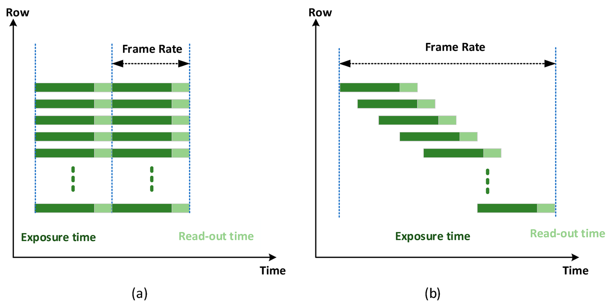
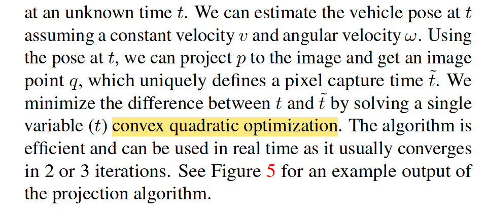
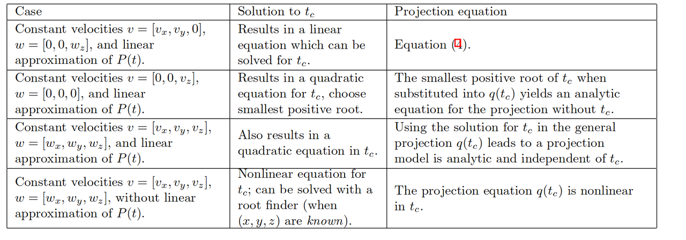
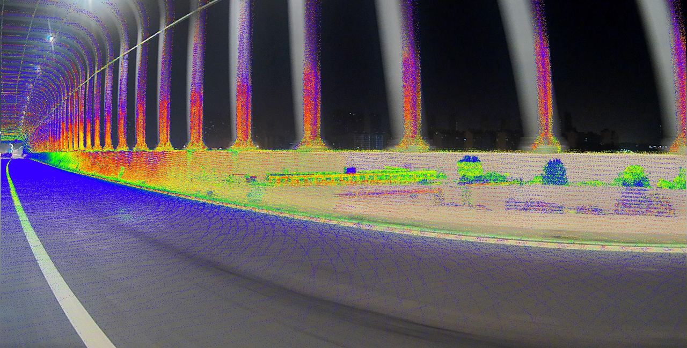
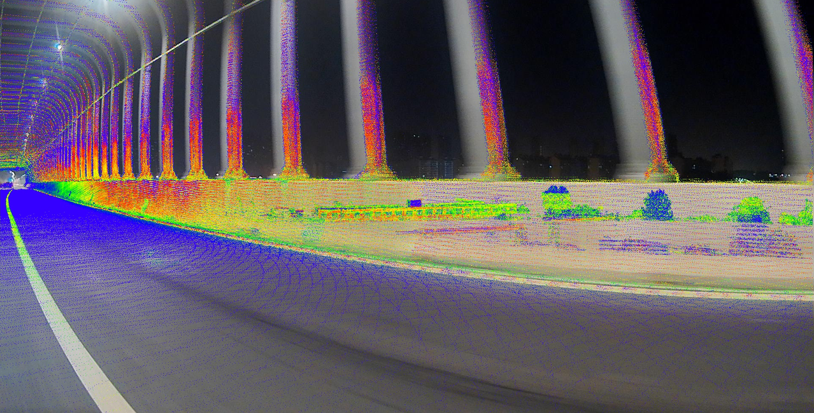

Unlike global shutter cameras that capture the entire frame at once, rolling shutter cameras capture each row sequentially, leading to image distortions when there is motion. 
This paper discusses the rolling shutter effect in cameras and methods to handle it. 

# Fundamentals of Rolling Shutter Camera

<figure style="text-align: center;">
    
    <figcaption style="font-weight: normal;">Global Shutter Camera v.s. Rolling Shutter Camera. (a) Global Shutter Camera. (b) Rolling Shutter Camera. (figure from [6])</figcaption>
</figure>

To efficiently capture and read the image, the time constraints for rolling shutter camera are:

1. The read-out time for each row is the same

2. The exposure time for each row is the same

3. The start of the read-out time of each row begins instantly after the end of the previous row's read-out time

4. The exposure should start after the readout of the last frame

# Warping Transformation for Undistortion

The warping transformation for undistorting is based on the same depth assumption [1].

The pixel of $^{c_n}\mathbf{q}_k$ captured by the rolling shutter camera at row $N$ can be transformed to the imaginary global shutter camera at the first row as follows:

$$^{c_0}\mathbf{q}_k = \frac{z_{c_n}}{z_{c_0}} \mathbf{K} \cdot {}^{c_0}\mathbf{T}_{c(n)} \cdot \mathbf{K}^{-1} \cdot {}^{c_n}\mathbf{q}_k$$

Usually, it is assumed that $z_{c_0} = z_{c_n}$, which simplifies above equation as follows:

$$^{c_0}\mathbf{q}_k = \mathbf{K} {}^{c_0}\mathbf{T}_{c(n)} \mathbf{K}^{-1} \cdot {}^{c_n}\mathbf{q}_k \tag{1}$$

This can be seen as a type of warp operation:

$$^{c_0}\mathbf{A}_{c(n)} = \mathbf{K} {}^{c_0}\mathbf{T}_{c(n)} \mathbf{K}^{-1}$$

and the equation (1) can be written as:

$$^{c_0}\mathbf{q}_k = {}^{c_0}\mathbf{A}_{c(n)} \cdot {}^{c_n}\mathbf{q}_k $$

where, the $^{c_0}\mathbf{A}_{c(n)}$ denotes the warp matrix projecting the pixel from the $c_{(n)}$ (exposure at time of line $n$) to the $c_0$ (exposure at time of line 0).

# Rolling Shutter Projection

## Problem formulation

<figure style="text-align: center;">
    
    <figcaption style="font-weight: normal;">description of the problem from [4]</figcaption>
</figure>

In [4], it says this estimation problem is a convex optimization problem. Let us break it down and figure out how to reach the conclusion.

Suppose a constant velocity, $v$, and angular velocity $w$ camera pose, then the pixel pose at time, $t$, relative to a pose, $\mathbf{T}_0$, is (using $T(3)\times SO(3)$ to represent the pose, $SE(3)$) [5]

$$\begin{aligned}
\mathbf{T}_c(\delta t)
&=\mathbf{T}_0\boxplus \mathbf{\tau}(\delta t)\\
&=\mathbf{T}_0
\begin{bmatrix}
e^{[\delta t*w]_\times} & \delta t*v\\
0 & 1
\end{bmatrix}
\end{aligned}$$

We can project a point, $\mathbf{p}$, into the image plane and get its row numbers, $v$, as (here we use the pinhole camera model)

$$
\begin{bmatrix}
x^c\\
y^c\\
z^c
\end{bmatrix} =
\mathbf{T}_c^{-1}
\begin{bmatrix}
x\\
y\\
z
\end{bmatrix}
,\quad 
\begin{bmatrix}
u\\
v\\
1
\end{bmatrix} =
\mathbf{K}
\begin{bmatrix}
x^c/z^c\\
y^c/z^c\\
1
\end{bmatrix}
$$

and the readout time at line $v$ is $t^\prime = t_0+v\Delta t$, where $t_0$ is the time in the first row and $\Delta t$ the readout time of each row. Minimizing the estimated time and the assumption time we get the problem formulation

$$
\underset{t}{\arg\max} \|t - t^\prime \left(K, \mathbf{T}(t), \mathbf{p}\right) \|^2 \tag{2}
$$

where, $t$, can be interpreted as the relative time to the start of the first row.

## Convexity check

Let the LiDAR points, $\mathbf{p}$, undistorted to the time of the first row as, $\mathbf{x}$, we have, $\mathbf{x} = \mathbf{T}_0^{-1}\mathbf{p}$

Then points in the camera coordinate is, 

$$\mathbf{x}^c = 
\begin{bmatrix}
e^{[wt]_\times} & vt\\
0 & 1
\end{bmatrix}^{-1}
\mathbf{x}$$

where $t$ is the relative time to first row. Here 

$$\begin{bmatrix}
e^{[wt]_\times} & vt\\
0 & 1
\end{bmatrix}^{-1}$$

can be approximated as 

$$\begin{bmatrix}
e^{[-wt]_\times} & -vt\\
0 & 1
\end{bmatrix}$$ 

if we treat $SE(3)$ as composite of $\left< SO(3), \mathbb{R}^3 \right>$. **Failed to prove it is convex**.  Can find the table below [3].

<figure style="text-align: center;">
    
    <figcaption style="font-weight: normal;">Different assumptions on the motion lead to different types of solutions for tc and the projection q(tc).</figcaption>
</figure>

## The Iterative Solution

We can resort to iterative algorithm to solve problem (2) [1].

### Convergence proof: Contraction operator

To prove the solution of the iterative algorithm to problem (2) always exists and is unique, we can prove the operator, $t^\prime$, in problem (2) is a contraction mapping, i.e.,

$$\exist q\in[0,1) \text{ such that } \|t^\prime(t_1)-t^\prime(t_2)\| < q\|t_1-t_2\|$$

For simplicity, we assume $w=0$ and $v=[0, v_y, 0,]$,  then we have (using the pinhole camera model)

$$\|t^\prime(t_1) - t^\prime(t_2)\| = \|f_y \frac{(t_1-t_2)v_y}{z}\Delta t\|$$

where $f_y$ is the focal length of the height of the camera and $\Delta t$ is the difference of exposure time of two consecutive rows.

So, we only need to establish $\|f_y \frac{(t_1-t_2)v_y}{z}\Delta t\| < \|t_1-t_2\|$, which is equivalent to $f_y\frac{|v_y\Delta t|}{z}<1$, For a 4K resolution image, we have $f_y=1920$, $\Delta t = 1/(20*2160)$. For a typical car on the highway, the maximal velocity may be $v_y=80$. So, $f_y*|v_y*\Delta t| < 1920*80/20/2160 = 3.5$. Thus, for objects with $z>3.5$. It is a contraction operator. In a real scenario, $v_y$ will be much smaller. So, most of the conditions are satisfied except for extremely close points.

Though the simplified problem, it gives us enough insights into why the iterative algorithm works. However, we should note that, the convergence may not hold for other types of camera model, e.g., wide-angle fish-eye camera, where at the edge of the image, the distortion is much more severe.

# Experiments

<figure style="text-align: center;">
    

        
        
    

    <figcaption style="font-weight: normal;">
        Projecting the LiDAR points onto the image plane: left is without rolling shutter compensation, right is with rolling shutter compensation.
    </figcaption>
</figure>

In this experiment, we project the LiDAR points onto the image plane with and without rolling shutter compensation [7]. From the figure, we can see that with rolling shutter compensation, the LiDAR points are more aligned with the image. However, we still need to compensate the exposure time to get more accurate results.

# References

> \[1] S. Hong, C. Zheng, H. Yin and S. Shen, "Rollvox: Real-Time and High-Quality LiDAR Colorization with Rolling Shutter Camera," 2023 IEEE/RSJ International Conference on Intelligent Robots and Systems (IROS), Detroit, MI, USA, 2023, pp. 7195-7201, doi: 10.1109/IROS55552.2023.10342172.

> \[2] Li, You. "Spatial-Temporal Measurement Alignment of Rolling Shutter Camera and LiDAR." *IEEE Sensors Letters* 6.12 (2022): 1-4.

> \[3] Meingast, Marci, Christopher Geyer, and Shankar Sastry. "Geometric models of rolling-shutter cameras." *arXiv preprint cs/0503076* (2005).

> \[4] Sun, Pei, et al. "Scalability in perception for autonomous driving: Waymo open dataset." *Proceedings of the IEEE/CVF conference on computer vision and pattern recognition*. 2020.

> \[5] Sola, Joan, Jeremie Deray, and Dinesh Atchuthan. "A micro Lie theory for state estimation in robotics." *arXiv preprint arXiv:1812.01537* (2018).

> \[6] Li, Jingyi, and Weipeng Guan. 2018. "The Optical Barcode Detection and Recognition Method Based on Visible Light Communication Using Machine Learning" Applied Sciences 8, no. 12: 2425.

> \[7] Mao, Jiageng, Minzhe Niu, Chenhan Jiang, Hanxue Liang, Jingheng Chen, Xiaodan Liang, Yamin Li et al. "One million scenes for autonomous driving: Once dataset." arXiv preprint arXiv:2106.11037 (2021).
